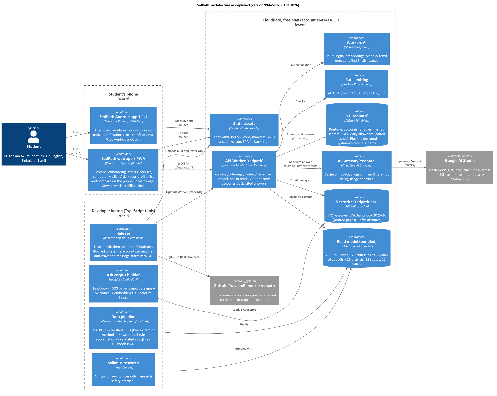

# ZedPath

**Everything after A/Ls, in one place.**

ZedPath helps a Sri Lankan student between A/L results and their next step. You enter your results
once and see every path you can actually reach: state university courses, private degrees,
gazetted job exams, vocational courses, study abroad and a retry. Each one comes with its deadlines
and with answers that link back to the official page they came from.

Free, mobile-first, in Sinhala, Tamil and English.

> **Live:** **https://zedpath.teamkestrel.workers.dev** (works on any phone; installable) · Android app built with
> Capacitor (`native/`). Built for the IntelliCon '26 Buildathon (Team Kestrel, Education domain). Gate 1 (Problem &
> Proof) submitted; Gate 3 final due 11 Oct 2026. See [Roadmap](#roadmap).

---

## The problem

In 2025, **281,810** students sat the A/L. **176,527** qualified for university, and there were
only **42,937** state university places.<sup>1</sup>

Within a few weeks of results, every one of them has to decide:

- **State university:** rank up to 125 course choices under rules in a 200+ page UGC handbook that
  changes every year, inside a three-week application window.
- **Everything else:** private degrees, study abroad, gazetted job exams such as Customs, vocational
  courses, or sitting again. Each runs on its own website, notices and calendar.

Most students decide from tuition teachers, seniors and Facebook groups. A badly ordered preference
list, an ineligible choice, a missed aptitude test or a path they never heard of can cost them a year.

We interviewed six people at six points on this path. One pattern came through: **nobody knew where
to look.**

> "I didn't have a proper way to find out, like about the Gazette." (E3, now applying for the Customs exam)
>
> "I missed one course... life altering situation." (E4, on a preference list)
>
> "Basically it's luck." (E5, on finding a foreign scholarship)

We hands-on tested the existing cut-off tools (findmydegree.lk, Unicompass, induwara.lk) and
reviewed ThuSh LK. All of them compare Z-scores with cut-offs. **None checks subject grade rules,
preference order or deadlines, and none covers routes outside the UGC.**

## What ZedPath does

| | Feature | What it means for the student | Status |
|---|---|---|---|
| 1 | **Results in, paths out** | Stream, district, Z-score and grades, plus sports and achievements ("beyond grades"). No account needed. | ✅ Live |
| 2 | **Safe / Likely / Reach** | All 255 Uni-Codes banded against **five years** of official district cut-offs, with a trend and a cut-off chart. | ✅ Live |
| 3 | **Fine-print check** | Subject and minimum-grade rules for all 121 courses from the handbook. Hidden courses always say *why*, with the page. | ✅ Live |
| 4 | **My list (preference checker)** | Warns when a Safe course sits above a Likely/Reach one or when there is no Safe course; proposes a fixed order; copies Uni-Codes. | ✅ Live |
| 5 | **Compare and syllabi** | Up to 3 courses side by side; "What you'll study" from the university's own curriculum (12 programmes so far). | ✅ Live |
| 6 | **Every other route** | 52 official routes: private degrees, HNDs, professional bodies, vocational, job exams, scholarships abroad, with "open now". | ✅ Live |
| 7 | **Ask ZedPath, with sources** | Questions in English, Sinhala or Tamil, answered only from the UGC handbook and official routes, citing the page, using *your* results. | ✅ Live |
| 8 | **Accounts** | Optional username + password (no email or phone), recovery code, same details on any device. | ✅ Live |
| 9 | **Journey and reminders** | Deadlines marked *confirmed* or *estimated*, calendar file, native reminders. | Next |
| 10 | **Gazette watch** | Weekly scan of Government Gazette job-exam notices with alerts. | Planned |
| 11 | **People around you** | Verified seniors, a family summary card, a class view for teachers. | Later |

Concept screens (33 screens, one student's whole journey):
**[ZedPath mobile preview](https://claude.ai/artifact/N8wGu87fiY8ksUbb82yU8f)**. These are illustrative, with sample data.

## Why it needs AI

| Job | Without AI | With AI | Status |
|---|---|---|---|
| Turn the handbook into rules | 121 courses re-coded by hand every year | Each entry clause encoded as a rule **with its page**, by two independent encodings compared over 40.4 million student cases; the 5 disagreements resolved against the handbook (`data/rules/RECONCILIATION.md`) | ✅ Done for 2025/26 |
| Answer "can I, with my grades?" | A fixed FAQ can't | **Ask ZedPath**: multilingual search (Workers AI bge-m3 + Vectorize) finds the handbook pages, ZedPath's own rule engine checks the student's results, a language model writes the answer citing the pages | ✅ Live |
| Watch the Gazette | Someone reads every notice every week, and still misses some | Weekly scan classifies notices and extracts exam, eligibility and closing date | Planned |

**How it stays honest:** every rule and answer cites its source page. Eligibility and chances always come from
the tested rule engine, never from the language model's guess. Ask answers only from the handbook and official
routes, says "not found" otherwise, and never promises admission. Retrieval was calibrated on hand-checked
questions in all three languages.

## Architecture

As deployed (C4 container view, checked against `wrangler.jsonc` and `worker/*.ts`;
source: [docs/architecture/zedpath-architecture.puml](docs/architecture/zedpath-architecture.puml)):



In short:

- **One Cloudflare Worker** (`zedpath`, Hono + TypeScript) serves the API; the React app is free static assets.
- **Results need no database reads:** cut-offs, rules, routes and syllabi are compiled into a read model bundled
  inside the Worker, so a full eligibility check costs a few milliseconds of CPU on the free plan.
- **D1** holds only what must persist: optional student accounts (secrets stored as hashes) and Ask's daily
  allowance (salted hashes, no IPs).
- **Ask ZedPath:** Workers AI (bge-m3) embeds the question → Vectorize returns the closest of 572 handbook/route
  passages → the rule engine adds the student's own facts → the model answers through **AI Gateway** (cache on,
  payload logs off) with a fallback chain across four Flash models.
- **Clients:** the PWA, and a native Android app (Capacitor) that loads the live site in its own window and posts
  native notifications, so every web deploy also updates the app.
- **Delivery:** deploys come from the developer laptop only, blocked by a guard unless the Cloudflare account pin
  matches and the owner has given an explicit GO; every push to this public repo is scanned for secrets.

## Tech stack

| Layer | Choice | Why |
|---|---|---|
| App | React 19 + TypeScript, Vite, motion, PWA | Mobile-first, installable, small (141 KB JS gzip, within the 200 KB budget NFR-006); TypeScript everywhere |
| API | Hono 4 on Cloudflare Workers (+ Static Assets) | One Worker, free static hosting; Next.js SSR risked the free plan's 10 ms CPU limit (ADR in ZP-DOC-06) |
| Read model | Rulebook JSON compiled from the validated SQLite schema | Zero database reads per student request |
| Data | Cloudflare D1 (36-table schema; accounts + allowance at runtime) | Foreign keys, CHECK constraints, cascade delete |
| Ask | Workers AI (bge-m3), Vectorize, AI Gateway, Google Flash models | Multilingual retrieval, caching and analytics, cited answers |
| Protection | Workers Rate Limiting, PBKDF2 on the device, hashed sessions | Brute-force and privacy protection within the free plan |
| Android | Capacitor 8 (`native/`) | Native window and notifications; web deploys update the app |
| Tests | Vitest (83 tests), characterisation tests, planted-bug checks | Rules and accounts proven, not assumed |

Everything runs on Cloudflare's free plan, so a student on mobile data gets answers quickly and the project
costs nothing until it grows.

## Roadmap

| Stage | Scope | Status |
|---|---|---|
| **Gate 1: Problem & Proof** | Six interviews, tool test, market sizing, first rules and dates collected by hand | ✅ Submitted |
| **Core flow** | Results once → 255 Uni-Codes banded from five years of official cut-offs → 52 other routes → course pages with sources, cut-off charts and syllabi → public link | ✅ Live |
| **Applying** | My list with order checks ✅ · Compare ✅ · accounts ✅ · Journey with confirmed/estimated dates and reminders | 🔨 Building |
| **AI and depth** | Handbook → rules (two-model reconciled) ✅ · Ask ZedPath with cited pages in three languages ✅ · weekly Gazette scan | 🔨 Building |
| **Apps** | Installable PWA ✅ · native Android app (Capacitor) ✅ · Google Play (internal testing first) | 🔨 Building |
| **People and money** | Verified seniors, family share card, teacher view, costs by campus, Sinhala/Tamil interface | Later |

## Engineering documentation

ZedPath is documented the way a software company would document it: one controlled set, written in
dependency order, each document following a named international standard, with document control, revision
history, approval, numbered requirements and full traceability from interview evidence to test case.
Each document is available as Markdown (source), Word and PDF.

| ID | Document | Standard | Status |
|---|---|---|---|
| [ZP-DOC-00](docs/00-documentation-standard/) | Documentation Standard | ISO/IEC/IEEE 15289:2019 | v1.0 approved |
| [ZP-DOC-01](docs/01-vision-and-scope/) | Vision and Scope | Wiegers and Beatty template | v1.0 approved |
| [ZP-DOC-02](docs/02-user-stories/) | User Stories (50 stories, 74 acceptance criteria) | Cohn, INVEST, MoSCoW | v1.0 approved |
| [ZP-DOC-03](docs/03-requirements/) | Software Requirements Specification (80 FR, 32 NFR, 38 business rules) | ISO/IEC/IEEE 29148:2018 | v1.0 approved |
| [ZP-DOC-04](docs/04-use-cases/) | Use Case Model (18 use cases) | UML 2.5.1, Cockburn | v1.0 approved |
| [ZP-DOC-05](docs/05-data-design/) | Data Design (EER → relational → normalisation → D1), incl. student accounts | Elmasri and Navathe EER | v0.9 in review |
| ZP-DOC-06 | Software Architecture | ISO/IEC/IEEE 42010, C4, ADRs | planned |
| ZP-DOC-07 | UI/UX Specification | Material Design 3, WCAG 2.2 AA | planned |
| ZP-DOC-08 | Test Plan | ISO/IEC/IEEE 29119-3 | planned |

The documents are built from Markdown by a small TypeScript tool ([docs/_build](docs/_build/)).

## Trust rules (built into the product)

- **Official numbers only.** Every cut-off comes from the UGC's published tables and links to its source.
- **Honest about uncertainty.** It never says "you will get in". Past cut-offs describe the past, and the app says so.
- **No paid placement.** No institute can pay to appear in results or look more recognised than it is.
- **Nothing stored without asking.** No account needed to explore. Sharing with a teacher or parent is always the student's choice.

## Running locally

```
npm install
npx wrangler d1 migrations apply zedpath --local   # local copy of the database (accounts, allowance)
npm run dev                                         # Vite + the Workers runtime at http://localhost:5173
npm test                                            # 83 tests
```

Accounts need a local `PEPPER=<random hex>` line in `.dev.vars` (gitignored). Ask ZedPath also needs
`GEMINI_API_KEY` and uses the real Workers AI and Vectorize from local dev. The Android app: see
[native/README.md](native/README.md).

### Repo safety (for contributors)

This repo is public. Two automatic guards protect it:

- `.githooks/pre-push`: scans every pushed commit for API keys, tokens, private keys and `.env`/`.dev.vars`
  files, and blocks the push on a hit. Enable it once per clone: `git config core.hooksPath .githooks`
- `.claude/hooks/zedpath-guard.cjs`: an AI-assistant guard. It blocks deploys and other live changes
  without the owner's explicit go-ahead and the correct, pinned Cloudflare account.
  Tests: `bash .claude/hooks/test-guard.sh`

Secrets live in `.dev.vars` locally (gitignored) and in Cloudflare secrets in production. They are never committed.

## Team

**Team Kestrel** · B.M.P Banneka (solo, undergraduate bracket), with Claude (Anthropic) as coding partner.

## Disclaimer

ZedPath is an independent project. It is not affiliated with the University Grants Commission, the
Department of Examinations, or any university or institute. Cut-offs and rules come from the UGC's official
2021/22 to 2025/26 tables and the 2025/26 handbook, verified and cited, but ZedPath can still be wrong: always
confirm on the UGC application. Past cut-offs describe the past, and final selection is always decided by the UGC.

---

<sup>1</sup> Department of Examinations, G.C.E. (A/L) 2025 results; UGC University Admission 2025/26.
See also: National Education Commission, *Study on Career Guidance in General Education in Sri Lanka*,
Research Series No. 08 (2014).
