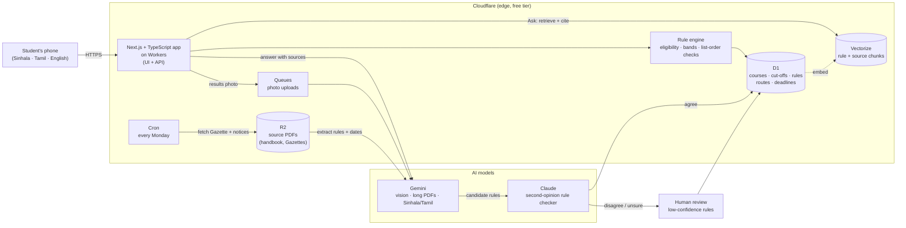

# ZedPath

**Everything after A/Ls, in one place.**

ZedPath helps a Sri Lankan student between A/L results and their next step. You enter your results
once and see every path you can actually reach: state university courses, private degrees,
gazetted job exams, vocational courses, study abroad and a retry. Each one comes with its deadlines
and with answers that link back to the official page they came from.

Free, mobile-first, in Sinhala, Tamil and English.

> **Status: in active build** for the IntelliCon '26 Buildathon (Team Kestrel, Education domain).
> Gate 1 (Problem & Proof) is submitted. The app code is landing in this repo now. See [Roadmap](#roadmap).

---

## The problem

In 2025, **281,810** students sat the A/L. **176,527** qualified for university, and there were
only **42,937** state university places.1

Within a few weeks of results, every one of them has to decide:

- **State university:** rank up to 125 course choices under rules in a 200+ page UGC handbook that
  changes every year, inside a three-week application window.
- **Everything else:** private degrees, study abroad, gazetted job exams such as Customs, vocational
  courses, or sitting again. Each runs on its own website, notices and calendar.

Most students decide from tuition teachers, seniors and Facebook groups. A badly ordered preference
list, an ineligible choice, a missed aptitude test or a path they never heard of can cost them a year.

We interviewed six people at six points on this path. One pattern came through: **nobody knew where
to look.**

> "I didn't have a proper way to find out, like about the Gazette." (E3, now applying for the Customs exam)
>
> "I missed one course... life altering situation." (E4, on a preference list)
>
> "Basically it's luck." (E5, on finding a foreign scholarship)

We hands-on tested the existing cut-off tools (findmydegree.lk, Unicompass, induwara.lk) and
reviewed ThuSh LK. All of them compare Z-scores with cut-offs. **None checks subject grade rules,
preference order or deadlines, and none covers routes outside the UGC.**

## What ZedPath does

| | Feature | What it means for the student |
|---|---|---|
| 1 | **Results in, paths out** | Stream, district, Z-score and grades. That's all it needs. No account. |
| 2 | **Safe / Likely / Reach** | Each course is banded against **five years** of district cut-offs, not one, with a trend. |
| 3 | **Fine-print check** | Subject and minimum-grade rules from the handbook. Hidden courses always say *why*. |
| 4 | **Preference list checker** | Flags orders that would lock you out of a course you wanted more, and gives uni-codes ready to copy. |
| 5 | **Every other route** | Private degrees, HNDs, professional bodies, teaching colleges, job exams and scholarships, matched to your results. |
| 6 | **Journey and deadlines** | Results through registration, including the aptitude tests universities run on their own dates. Each date is marked *confirmed* or *estimated*. |
| 7 | **Gazette watch** | Weekly scan of Government Gazette notices, with an alert when an exam you qualify for opens. |
| 8 | **Ask, with sources** | Questions in Sinhala, Tamil or English, answered from *your* results, with every answer citing its page. |
| 9 | **People around you** | Verified seniors, a one-card family summary for WhatsApp, and a class view for teachers. |

Concept screens (33 screens, one student's whole journey):
**[ZedPath mobile preview](https://claude.ai/artifact/N8wGu87fiY8ksUbb82yU8f)**. These are illustrative, with sample data.

## Why it needs AI

| Job | Without AI | With AI |
|---|---|---|
| Read a results sheet | The student types 6+ fields; one typo breaks every check | A vision model reads grades, Z-score and district from a phone photo. The photo is deleted right after. |
| Turn the handbook into rules | 255 course codes re-coded by hand every year, in three languages | An LLM turns each entry clause into a rule **with the page it came from** |
| Watch the Gazette | Someone reads every notice every week, and still misses some | Weekly scan classifies notices and extracts exam, eligibility and closing date |
| Answer "can I, with my grades?" | A fixed FAQ can't | Search the rule set, answer from the student's own results, cite the page |

**How it stays honest:** every rule stores its source page. A second model double-checks every
extracted rule. Low-confidence extractions are reviewed by a person before going live. The rule
engine is tested against cases verified by hand.

## Architecture

## Tech stack

| Layer | Choice | Why |
|---|---|---|
| App + API | Next.js + TypeScript on Cloudflare Workers | One codebase; types catch rule mistakes before students see them; runs close to users in Sri Lanka |
| Data | Cloudflare D1 (SQLite) | Rules, cut-offs, routes and dates, each linked to its source |
| Files | Cloudflare R2 | Source PDFs (handbook, Gazettes) kept for citation |
| Search | Cloudflare Vectorize | Retrieval for cited answers |
| Jobs | Cron Triggers + Queues | Weekly Gazette scan; photo processing |
| AI | Gemini; Claude | Reading photos/PDFs and writing in three languages; independent rule checking |

Everything runs on Cloudflare's free tier, so a student on mobile data gets answers quickly and the
project costs nothing until it grows.

## Roadmap

| Stage | Scope | Status |
|---|---|---|
| **Gate 1: Problem & Proof** | Six interviews, tool test, market sizing, first rules and dates collected by hand | ✅ Submitted |
| **Core flow** | Enter results once → state courses banded Safe/Likely/Reach from district cut-offs → other routes alongside → course pages with sources → on a public link | 🔨 Building |
| **Applying** | Preference-list builder with order checks, aptitude-test tracker, Journey timeline with confirmed/estimated dates | 🔨 Building |
| **AI and depth** | Handbook → rules, results photo → grades, weekly Gazette scan with alerts, Ask with source links | Next |
| **People and money** | Verified seniors, family share card, teacher view, costs by campus, scholarships abroad | Later |

## Engineering documentation

ZedPath is documented the way a software company would document it: one controlled set, written in
dependency order, each document following a named international standard, with document control, revision
history, approval, numbered requirements and full traceability from interview evidence to test case.
Each document is available as Markdown (source), Word and PDF.

| ID | Document | Standard | Status |
|---|---|---|---|
| [ZP-DOC-00](docs/00-documentation-standard/) | Documentation Standard | ISO/IEC/IEEE 15289:2019 | v0.9 in review |
| [ZP-DOC-01](docs/01-vision-and-scope/) | Vision and Scope | Wiegers and Beatty template | v0.9 in review |
| [ZP-DOC-02](docs/02-user-stories/) | User Stories (50 stories, 74 acceptance criteria) | Cohn, INVEST, MoSCoW | v0.9 in review |
| [ZP-DOC-03](docs/03-requirements/) | Software Requirements Specification | ISO/IEC/IEEE 29148:2018 | in progress |
| [ZP-DOC-04](docs/04-use-cases/) | Use Case Model (18 use cases) | UML 2.5.1, Cockburn | v0.9 in review |
| ZP-DOC-05 | Data Design (EER → relational → normalisation → D1) | Elmasri and Navathe EER | planned |
| ZP-DOC-06 | Software Architecture | ISO/IEC/IEEE 42010, C4, ADRs | planned |
| ZP-DOC-07 | UI/UX Specification | Material Design 3, WCAG 2.2 AA | planned |
| ZP-DOC-08 | Test Plan | ISO/IEC/IEEE 29119-3 | planned |

The documents are built from Markdown by a small TypeScript tool ([docs/_build](docs/_build/)).

## Trust rules (built into the product)

- **Official numbers only.** Every cut-off comes from the UGC's published tables and links to its source.
- **Honest about uncertainty.** It never says "you will get in". Past cut-offs describe the past, and the app says so.
- **No paid placement.** No institute can pay to appear in results or look more recognised than it is.
- **Nothing stored without asking.** No account needed to explore. Sharing with a teacher or parent is always the student's choice.

## Running locally

The app scaffold lands in the next commits. Setup instructions (`npm install`, local D1, `npm run dev`)
will be here as soon as there is something to run.

### Repo safety (for contributors)

This repo is public. Two automatic guards protect it:

- `.githooks/pre-push`: scans every pushed commit for API keys, tokens, private keys and `.env`/`.dev.vars`
  files, and blocks the push on a hit. Enable it once per clone: `git config core.hooksPath .githooks`
- `.claude/hooks/zedpath-guard.js`: an AI-assistant guard. It blocks deploys and other live changes
  without the owner's explicit go-ahead and the correct, pinned Cloudflare account.
  Tests: `bash .claude/hooks/test-guard.sh`

Secrets live in `.dev.vars` locally (gitignored) and in Cloudflare secrets in production. They are never committed.

## Team

**Team Kestrel** · B.M.P Banneka (solo, undergraduate bracket), with Claude (Anthropic) as coding partner.

## Disclaimer

ZedPath is an independent project. It is not affiliated with the University Grants Commission, the
Department of Examinations, or any university or institute. Until the data pipeline is verified,
figures shown in the app are sample data and must not be used for a real application. Final
selection is always decided by the UGC.

---

1 Department of Examinations, G.C.E. (A/L) 2025 results; UGC University Admission 2025/26.
See also: National Education Commission, *Study on Career Guidance in General Education in Sri Lanka*,
Research Series No. 08 (2014).
