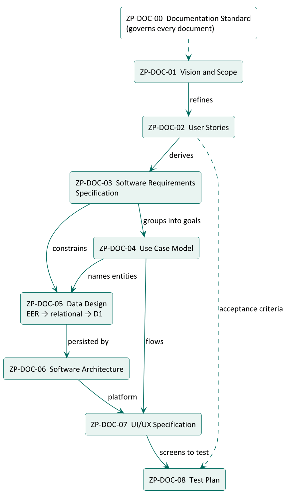
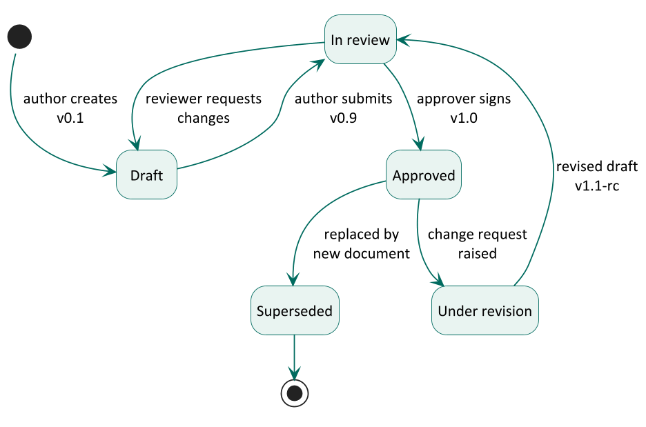
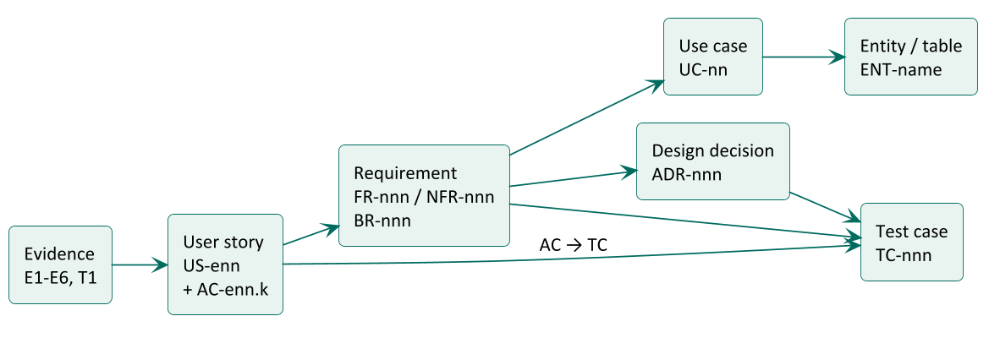

# Introduction

## Purpose

This standard defines how every ZedPath engineering document is identified, structured, written, styled,
reviewed, approved and changed. Following one standard makes the document set consistent, lets any reader
find the same information in the same place, and lets every requirement be traced from the evidence that
justified it to the test that proves it.

## Scope

This standard applies to every document in the `docs/` folder of the ZedPath repository (ZP-DOC-00 to
ZP-DOC-08 and any later additions). It does not apply to source-code comments, commit messages or the
repository README, which follow the conventions in the project CLAUDE.md.

## Intended audience

Authors and reviewers of ZedPath documents, and anyone assessing the quality of the engineering process
(for example, buildathon judges).

## Conformance

A document conforms to this standard when it meets every rule written with **shall**. Rules written with
**should** are recommended practice; a document may depart from them when the reason is recorded in its
revision history.

# The document set

## Document register

The ZedPath document set follows the classic engineering order: each document refines the one before it.
A document **shall not** be approved before the documents it depends on are at least *In review*.

Table: ZedPath document register

| ID | Title | Governing standard or model | Answers the question |
|---|---|---|---|
| ZP-DOC-00 | Documentation Standard | ISO/IEC/IEEE 15289:2019 | How do we write and control documents? |
| ZP-DOC-01 | Vision and Scope | Wiegers and Beatty vision and scope template | Why are we building this, and what is in and out? |
| ZP-DOC-02 | User Stories | Cohn user stories, INVEST, MoSCoW | Who needs what, and how do we know it is done? |
| ZP-DOC-03 | Software Requirements Specification | ISO/IEC/IEEE 29148:2018 | What exactly shall the system do, and how well? |
| ZP-DOC-04 | Use Case Model | UML 2.5.1; Cockburn fully dressed use cases | How do actors achieve their goals, step by step? |
| ZP-DOC-05 | Data Design | Enhanced ER (Elmasri and Navathe); relational normalisation | What data exists, how is it related and stored? |
| ZP-DOC-06 | Software Architecture | ISO/IEC/IEEE 42010:2022; C4 model; arc42; ADRs | How is the system structured and deployed, and why? |
| ZP-DOC-07 | UI/UX Specification | Material Design 3; WCAG 2.2 AA | What does the user see and how do they move through it? |
| ZP-DOC-08 | Test Plan | ISO/IEC/IEEE 29119-3:2021 | How do we prove the system meets its requirements? |

## Folder and file layout

- Each document **shall** live in its own folder `docs/NN-kebab-title/`, where *NN* is its two-digit number.
- The source file **shall** be named `ZP-DOC-NN_Title-In-Words.md`.
- Generated files **shall** sit beside the source with the same base name: `.docx` and `.pdf`.
- Diagram sources **shall** live in `diagrams/` inside the document folder, as `.puml` files, with the rendered
  `.png` beside them.

# Identification

## Document identifiers

Every document has a permanent identifier **ZP-DOC-NN**. Identifiers are never reused, even if a document is
withdrawn.

## Item identifiers

Items inside documents carry identifiers so they can be referenced and traced. Identifiers **shall** be unique
across the document set and **shall** never be renumbered or reused after approval; a deleted item keeps its
number and is marked *Deleted*.

Table: Identifier schemes for items inside documents

| Item | Pattern | Example | Defined in |
|---|---|---|---|
| Evidence source | E*n*, T*n* | E4, T1 | ZP-DOC-02 |
| Persona | P*n* | P1 | ZP-DOC-02 |
| Epic | EP*n* | EP3 | ZP-DOC-02 |
| User story | US-*enn* (epic digit + number) | US-302 | ZP-DOC-02 |
| Acceptance criterion | AC-*enn*.*k* | AC-302.2 | ZP-DOC-02 |
| Business objective | BO-*n* | BO-1 | ZP-DOC-01 |
| Feature | FE-*n* | FE-4 | ZP-DOC-01 |
| Business rule | BR-*nnn* | BR-012 | ZP-DOC-03 |
| Functional requirement | FR-*nnn* | FR-045 | ZP-DOC-03 |
| Non-functional requirement | NFR-*nnn* | NFR-007 | ZP-DOC-03 |
| Use case | UC-*nn* | UC-03 | ZP-DOC-04 |
| Entity or table | singular noun in PascalCase (conceptual); snake_case (physical) | Offering; offering | ZP-DOC-05 |
| Architecture decision | ADR-*nnn* | ADR-001 | ZP-DOC-06 |
| Risk | RK-*nn* | RK-04 | ZP-DOC-01 |
| Test case | TC-*nnn* | TC-118 | ZP-DOC-08 |

# Versioning and status

## Version numbers

- **0.1 to 0.8**: working drafts.
- **0.9**: complete draft submitted for review.
- **1.0**: first approved version.
- **1.x**: approved revisions that do not change scope (corrections, clarifications, added detail).
- **2.0, 3.0...**: approved revisions that change scope or invalidate earlier commitments.

## Status lifecycle

Every document **shall** show one of these statuses on its cover, in its header and in its document control page.

Table: Document statuses and their meaning

| Status | Meaning | Who changes it |
|---|---|---|
| Draft | Being written; content may change without notice | Author |
| In review | Complete; awaiting review comments and approval | Author submits |
| Approved | Signed off by the approver; the baseline for later work | Approver |
| Under revision | An approved document is being changed; the last approved version stays in force | Author |
| Superseded | Replaced by another document named in its revision history | Approver |

# Review and approval

## Roles

Table: Documentation roles

| Role | Responsibility | Held by |
|---|---|---|
| Document owner | Accountable for the content being correct and current | B.M.P Banneka, Product Owner |
| Author | Writes and revises the document | Team Kestrel (drafted with Claude) |
| Reviewer | Checks consistency, completeness and traceability | Claude (AI coding partner) and the owner |
| Approver | Accepts the document as the baseline | B.M.P Banneka, Product Owner |

## Approval procedure

1. The author sets the version to 0.9 and the status to *In review*, and commits.
2. Reviewers record findings; the author resolves each one and adds a revision-history row.
3. The approver signs the approval table (name and date), sets version 1.0 and status *Approved*.
4. The approval commit is tagged `ZP-DOC-NN-v1.0` and noted in `WORKLOG.md`.

AI-generated content **shall** be reviewed by the product owner before approval. An AI reviewer may check
consistency and traceability, but cannot approve.

# Change control

- The Markdown source is the **controlled** version. Generated `.docx` and `.pdf` files **shall not** be edited
  by hand; they are rebuilt with `node docs/_build/build.ts`.
- Every new version **shall** add a revision-history row stating what changed and why.
- A change to an approved item **shall** be checked against everything that traces from it (see the
  traceability rules below), and those documents updated in the same commit or flagged in WORKLOG.md.
- Every change is committed to the public repository; Git history is the audit trail.

# Mandatory structure

## Front matter

Every source file **shall** begin with a front-matter block containing: `id`, `title`, `subtitle`, `version`,
`date`, `status`, `classification`, `owner`, `author`, `approver`, `standard` (the governing standard), at least
one `revision` line, and optionally `reviewer` lines.

## Generated front pages

The build tool generates, in this order: the **cover page**; the **document control** page (document
information, revision history, review and approval table); the **contents**; the **list of figures** and
**list of tables** when the document has any.

## Mandatory sections

Every document **shall** contain:

1. **Introduction**, with at least Purpose, Scope and Intended audience. Documents that sit in the chain
   **shall** also state their relationship to other documents.
2. **Body** sections required by the governing standard named in the register.
3. **Appendix: Glossary** of terms and abbreviations used.
4. **Appendix: References** to every external source cited.

# Writing rules

## Requirement language

Table: Keywords that express obligation

| Keyword | Meaning |
|---|---|
| **shall** | Mandatory; the system or document is non-conforming without it |
| **should** | Recommended; departures need a recorded reason |
| **may** | Optional |
| **will** | A statement of fact or intent, not a requirement |

## Style rules

- Write in plain British English, in the active voice, in short sentences.
- One requirement per statement. Each requirement **shall** be verifiable.
- Avoid unverifiable words: *user-friendly, fast, easy, flexible, robust, etc., and so on, as appropriate*.
  Replace them with numbers and units (for example, "within 2 seconds on a 3G profile").
- Write dates in prose as *5 October 2026*; in data, tables of values and identifiers, use ISO 8601 *2026-10-05*.
- Refer to sections in words: "Section 4.2". The section-sign symbol **shall not** be used.
- Define every abbreviation on first use and in the glossary.
- Sinhala or Tamil terms are written in English with the original in brackets on first use where it helps.
- Quote evidence verbatim and attribute it to its code (for example, E4).
- Do not refer to a table or figure by number in running text; describe it ("the table below"), because
  numbers are assigned automatically.

## Privacy in documents

Documents are public. They **shall not** contain personal data. Interviewees are referred to only by codes
(E1 to E6). Account identifiers, keys and tokens **shall never** appear in a document.

# Visual identity

## Page and typography

Table: Page and typography specification

| Element | Specification |
|---|---|
| Page | A4 portrait; margins 2.0 cm (top 2.35 cm, to clear the header); header and footer 1.0 cm from the edge |
| Body text | Calibri 10.5 pt, line spacing 1.1, colour #1B1F1E |
| Heading 1 | Calibri 17 pt bold, ZedPath green #006B5F, rule below, starts a new page |
| Heading 2 | Calibri 13.5 pt bold, #1B1F1E |
| Heading 3 | Calibri 11.5 pt bold, dark green #00504A |
| Captions | Calibri 9 pt italic, #55605D, numbered automatically: "Table n:" above tables, "Figure n:" below figures |
| Code | Consolas 8.5 pt on a light grey panel |
| Tables | Header row green #006B5F with white bold text, alternate rows tinted #F3F8F6, 0.5 pt grey rules |
| Call-outs | Tinted panel with a green bar on the left; used for notes and the narrative of user stories |

## Header and footer

- **Header:** "ZedPath | *document title*" on the left; "*document ID* · v*version* · *status*" on the right.
- **Footer:** "Classification: Public" on the left; "Uncontrolled when printed" in the centre;
  "Page *n* of *N*" on the right.
- The cover page carries no header or footer.

## Section numbering

Headings are numbered automatically: 1, 1.1, 1.1.1. Appendices are lettered: Appendix A, A.1. Front
pages (document control, contents and lists) are not numbered and do not appear in the contents.

# Diagram standards

Diagrams are written as code (PlantUML) so they can be reviewed and versioned like text. Each diagram
**shall** use the notation below for its kind, **shall** have a caption, and **shall** be readable when
printed in greyscale.

Table: Diagram notations by purpose

| Purpose | Notation | Used in |
|---|---|---|
| Story map | Mind map | ZP-DOC-02 |
| System context | C4 model, level 1 (System Context) | ZP-DOC-01, ZP-DOC-06 |
| Use cases | UML 2.5.1 use case diagram | ZP-DOC-04 |
| Behaviour and flows | UML activity and sequence diagrams | ZP-DOC-04, ZP-DOC-06 |
| Life cycles | UML state machine diagram | ZP-DOC-00, ZP-DOC-05 |
| Conceptual data model | Enhanced Entity-Relationship (EER), Chen notation as in Elmasri and Navathe: rectangles for entities, diamonds for relationships, ovals for attributes, underlined keys, double lines for weak entities and total participation, circles for specialisation with *d* (disjoint) or *o* (overlapping) | ZP-DOC-05 |
| Logical data model | Relational schema diagram, crow's foot (Information Engineering) notation | ZP-DOC-05 |
| Containers and deployment | C4 level 2 (Container) and UML deployment diagram | ZP-DOC-06 |
| Screen flow | Navigation map | ZP-DOC-07 |

# Traceability

Every item **shall** trace to its parent, so that any requirement can be followed from the evidence that
justified it to the test that proves it, and any test back to its reason.

- Each document **shall** contain a traceability table to its parent document.
- ZP-DOC-08 **shall** contain the full matrix from requirement to test case.
- An item with no parent is either unjustified (remove it) or reveals missing evidence (record it).

# Tooling and publication

- Sources are Markdown with front matter; diagrams are PlantUML; the build tool (`docs/_build/build.ts`,
  TypeScript) produces `.docx` with docx-js and `.pdf` through Microsoft Word, which also refreshes the
  contents, the lists of figures and tables, and page numbers.
- Generated files are committed, so readers without the tools can open every document.
- The repository is public, so every document is classified **Public**.
- Official third-party documents (for example UGC handbooks and cut-off tables) are cited but **shall not**
  be redistributed in the repository.

# Glossary {.appendix}

Table: Terms and abbreviations used in this standard

| Term | Meaning |
|---|---|
| ADR | Architecture Decision Record: a short record of one significant design decision and its reasons |
| Baseline | An approved version that later work builds on |
| C4 model | A model for software architecture diagrams at four levels: context, container, component, code |
| EER | Enhanced Entity-Relationship model: ER plus specialisation, generalisation and categories |
| PlantUML | A tool that draws diagrams from text descriptions |
| Traceability | The ability to follow an item to its origin and to everything derived from it |
| UML | Unified Modeling Language, maintained by the Object Management Group |

# References {.appendix}

Table: Standards and sources referred to in this standard

| Ref | Document |
|---|---|
| [1] | ISO/IEC/IEEE 15289:2019, *Systems and software engineering: Content of life-cycle information items (documentation)* |
| [2] | ISO/IEC/IEEE 29148:2018, *Systems and software engineering: Life cycle processes, Requirements engineering* |
| [3] | ISO/IEC/IEEE 42010:2022, *Software, systems and enterprise: Architecture description* |
| [4] | ISO/IEC/IEEE 29119-3:2021, *Software and systems engineering: Software testing, Part 3: Test documentation* |
| [5] | K. Wiegers and J. Beatty, *Software Requirements*, 3rd edition, Microsoft Press, 2013 (vision and scope template) |
| [6] | R. Elmasri and S. Navathe, *Fundamentals of Database Systems*, 7th edition, Pearson, 2016 (EER notation) |
| [7] | Object Management Group, *Unified Modeling Language*, version 2.5.1, 2017 |
| [8] | A. Cockburn, *Writing Effective Use Cases*, Addison-Wesley, 2001 |
| [9] | S. Brown, *The C4 model for visualising software architecture*, c4model.com |
| [10] | M. Nygard, *Documenting Architecture Decisions*, 2011 |
| [11] | W3C, *Web Content Accessibility Guidelines (WCAG) 2.2*, 2023 |
| [12] | Google, *Material Design 3*, m3.material.io |
