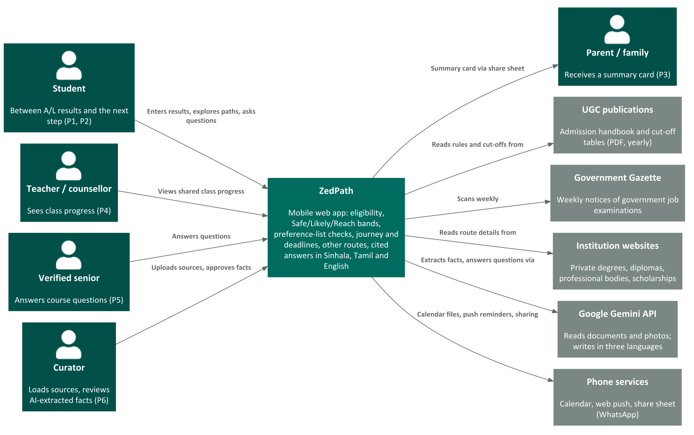

# Introduction

## Purpose

This document states **why** ZedPath is being built, **what** it will and will not do, and **how** its success
will be judged. It is the parent of every other ZedPath document: user stories (ZP-DOC-02) refine its features,
and the requirements specification (ZP-DOC-03) makes them precise.

## Scope

It covers the business requirements, the product vision, the scope of the first two releases, and the
business context (stakeholders, priorities, risks and deployment constraints). Technical design is out of scope.

## Intended audience

The product owner, buildathon judges and mentors, and anyone deciding whether ZedPath is worth building.

## Relationship to other documents

Table: Position of this document in the ZedPath document set

| Document | Relationship |
|---|---|
| Gate 1 Problem and Proof deck | Source. Evidence, market sizing and the three-week plan come from it |
| ZP-DOC-02 User Stories | Child. Each feature FE-n below is refined into the stories of epic EPn |
| ZP-DOC-03 Software Requirements Specification | Child. Business objectives become measurable quality requirements |
| ZP-DOC-06 Software Architecture | Child. The deployment constraints below bind the architecture |

# Business requirements

## Background

Every year about 275,000 students sit the G.C.E. Advanced Level (A/L) examination in Sri Lanka. In 2025,
**281,810** sat the examination, **176,527** qualified for university admission, and there were **42,937**
state-university places for the 2025/26 intake [1][2].

Within a few weeks of results, each student must decide. Students aiming for a state university must choose
and rank up to 125 course preferences under rules published in a handbook of more than 200 pages that changes
every year, inside a three-week application window. Because places are limited, most also need a backup:
a private or non-state degree, study abroad, a government job examination announced in the Gazette, a
vocational course, or sitting the examination again. Each path has its own rules, calendar and website.

Gate 1 research (six interviews, E1 to E6, and a hands-on test of four existing tools, T1) found one pattern:
students decide mostly on hearsay from tuition teachers, seniors and social-media groups. A badly ordered
preference list, an ineligible choice, a missed deadline or a path never heard of can cost a year. The
National Education Commission reached the same conclusion: most students and parents are unaware of
alternative education and career options [3].

## Business opportunity

No existing tool combines **the student's own results**, **every path they can reach** and **dated
deadlines** in one place. The tools tested (findmydegree.lk, Unicompass, induwara.lk, ThuSh LK) compare a
Z-score with cut-offs, but none checks subject and grade rules, preference order or deadlines, and none covers
routes outside the University Grants Commission (UGC) [4].

Two developments make a better tool feasible now:

1. **AI that reads documents.** Language models can turn a 200-page handbook and weekly Gazette PDFs into
   structured, page-cited rules, which previously needed manual re-coding every year.
2. **A free global edge platform.** Cloudflare's free plan provides hosting, database, storage, scheduled
   jobs, queues and AI inference at zero cost, close to users in Sri Lanka.

## Business objectives

Table: Business objectives and how each is measured

| ID | Objective | Measure and target |
|---|---|---|
| BO-1 | Reach students in the first admission cycle | 10,000 students use ZedPath in year one (serviceable obtainable market) |
| BO-2 | Make every fact checkable | 100% of displayed cut-offs, rules, dates and fees link to an official source |
| BO-3 | Let a student plan alone | A first-time user goes from entering results to a checked preference list in under 10 minutes without help |
| BO-4 | Prevent costly mistakes | Every ordering mistake defined in ZP-DOC-03 is detected in test, with no false "safe" claims |
| BO-5 | Show every path | All seven route groups (state, private, diploma, professional, vocational, job exam, abroad) are covered for every A/L stream |
| BO-6 | Operate at zero cost | Year-one hosting and inference stay within the Cloudflare free plan and free AI tiers |

## Market size

Table: Market sizing from the Gate 1 deck

| Measure | Estimate | Basis |
|---|---|---|
| Total addressable market | about 275,000 students a year | All A/L candidates face an after-results choice (269,613 sat in 2023; 281,810 in 2025) [1] |
| Serviceable available market | about 105,000 | Students who qualify (176,527 in 2025) × about 60% who use the internet [5] |
| Serviceable obtainable market (year one) | about 10,000 | Tuition teachers, A/L Facebook groups, Telegram channels and word of mouth; to be validated |

## Success metrics

- **Adoption:** unique students per admission cycle (target BO-1); returning visits after results day.
- **Task success:** share of usability-test participants who complete a checked preference list unaided (BO-3).
- **Trust:** reported mistakes per 1,000 facts, and median time to fix a reported mistake.
- **Accuracy:** share of AI-extracted rules on which the extractor and the independent checker agree; share
  approved without change by the curator.
- **Cost:** daily usage as a percentage of each free-plan limit (BO-6).

## Vision statement

> **For** Sri Lankan students between A/L results and their next step, **who** must choose among a state
> university, private degrees, job examinations and other routes within weeks and mostly on hearsay,
> **ZedPath is** a free, mobile-first guide **that** shows every path their own results can reach, with dated
> deadlines and answers that cite the official source, in Sinhala, Tamil and English.
> **Unlike** cut-off lookup sites and social-media groups, **ZedPath** checks subject and grade rules,
> preference order and deadlines, covers routes outside the UGC, and never states a fact without its source.

## Business risks

Table: Business risks, their likelihood and impact, and mitigations

| ID | Risk | Likelihood | Impact | Mitigation |
|---|---|---|---|---|
| RK-01 | A wrong rule or cut-off leads a student to a costly decision | Medium | High | Every fact sourced and dated; two-model check; human review of uncertain facts; one-tap mistake reports; wording never promises admission |
| RK-02 | Official sources change format or are published late | High | Medium | Source registry with fingerprints; extraction re-run per edition; dates shown as *estimated* until confirmed |
| RK-03 | Traffic spike on results day exhausts free-plan limits | Medium | High | Static front end served free; API responses cached; per-client rate limits; budget in ZP-DOC-06 |
| RK-04 | AI answers are wrong or poorly translated in Sinhala or Tamil | Medium | High | Answers grounded only in stored sources; refuse when unsupported; native-speaker review of interface text |
| RK-05 | ZedPath is mistaken for an official UGC service | Low | Medium | Clear independence notice on every page; no UGC branding |
| RK-06 | A single developer cannot finish R1 by 11 October 2026 | Medium | High | Walking skeleton first; MoSCoW release plan; AI-assisted development; R2 holds deferrable stories |
| RK-07 | Personal data of students (many are minors) is exposed | Low | High | No account to explore; profile kept on the device; photos deleted after reading; opt-in only |

## Assumptions and dependencies

Table: Assumptions (AS) and dependencies (DE)

| ID | Statement |
|---|---|
| AS-1 | The UGC continues to publish its admission handbook and cut-off tables as public documents each year |
| AS-2 | Government Gazette issues remain publicly available online each week |
| AS-3 | Target students have a smartphone with a modern browser and some mobile data |
| AS-4 | Cloudflare free-plan limits remain as verified on 5 October 2026 (recorded in ZP-DOC-06) |
| DE-1 | The UGC handbook and cut-off table for the 2025/26 intake (received 5 October 2026) |
| DE-2 | Cut-off tables for at least three earlier intakes, needed for Safe/Likely/Reach bands (US-203) |
| DE-3 | A free tier of the Google Gemini API, accessed through Cloudflare AI Gateway (to be verified in ZP-DOC-06) |

# Scope and limitations

## Major features

Each feature corresponds to one epic in ZP-DOC-02.

Table: Major features

| ID | Feature | Epic |
|---|---|---|
| FE-1 | Enter results once (typed, estimated or read from a photo), in three languages | EP1 |
| FE-2 | Eligible state-university courses with Safe/Likely/Reach bands, reasons for hidden courses, and sourced course pages | EP2 |
| FE-3 | Preference-list builder that detects ordering mistakes and copies uni-codes | EP3 |
| FE-4 | Journey with confirmed and estimated deadlines, aptitude tests and reminders | EP4 |
| FE-5 | Every other route matched to the student's results, with Gazette job-exam alerts | EP5 |
| FE-6 | Ask: cited answers in Sinhala, Tamil and English that refuse to guess | EP6 |
| FE-7 | Family share card, verified seniors, groups and a teacher view | EP7 |
| FE-8 | After selection: registration, Mahapola, gap-year plan, documents | EP8 |
| FE-9 | Data and trust: source registry, AI extraction with two-model check, review queue, mistake reports | EP9 |

## Scope of initial and subsequent releases

Table: Release scope by feature (story counts and points from ZP-DOC-02)

| Feature | Release R1, Gate 3 (11 October 2026) | Release R2, after the buildathon |
|---|---|---|
| FE-1 | All 5 stories | None |
| FE-2 | 7 stories: eligibility, bands, course page, filters, dream course, compare | Cost of living |
| FE-3 | All 4 stories | None |
| FE-4 | Journey, confirmed and estimated dates, aptitude tests, reminders | Special intake, custom steps |
| FE-5 | Route matcher, route details, Gazette alerts, retry | Recognition check, loan scheme, scholarships |
| FE-6 | Ask in three languages, citations, no predictions | Actions under answers |
| FE-7 | Family share card | Seniors, groups, teacher view |
| FE-8 | None | All 4 stories |
| FE-9 | All 7 stories | None |
| **Total** | **35 stories, 122 points** | **15 stories, 54 points** |

## Limitations and exclusions

ZedPath **will not**:

- submit applications or any data to the UGC or to any institution; it prepares the student to do so;
- predict future cut-offs or promise admission;
- accept payment for placement or ranking from any institution;
- send SMS, WhatsApp or email messages (not free on the chosen platform); reminders use calendar files and web push;
- require an account to explore, or store a student's results on the server without consent;
- keep results photos after they are read;
- cover postgraduate study or routes that do not start from A/L results;
- be a native mobile app in R1; it is a mobile web app that can be added to the home screen.

# Business context

## Stakeholder profiles

Table: Stakeholders, their interests and constraints

| Stakeholder | Main value to them | Attitude and interests | Constraints |
|---|---|---|---|
| Students (P1, P2) | Every reachable path, no costly mistakes | Anxious, time-pressed; trust peers more than institutions | Mobile data cost; language; low-end phones |
| Parents (P3) | A clear summary in their language | Want certainty about cost and recognition | Limited English; not app users |
| Teachers and counsellors (P4) | See who needs help before deadlines | Supportive; overloaded | No time for manual tracking |
| Verified seniors (P5) | A safe place to help juniors | Willing if protected from abuse | Must prove enrolment |
| Curator / product owner (P6) | Accurate data with little effort | Accountable for every published fact | One person in year one |
| UGC and Department of Examinations | Students who apply correctly | Publishers of the data, not partners | ZedPath must not appear official |
| Buildathon judges and mentors | Evidence of a real problem and a working, well-engineered solution | Assess Gates 1 to 3 | Gate 3 due 11 October 2026 |

## Project priorities

Table: Project priorities (constraint = fixed; driver = key success goal; degree of freedom = may be adjusted)

| Dimension | Role | Explanation |
|---|---|---|
| Schedule | Constraint | Gate 3 submission is due on 11 October 2026 |
| Cost | Constraint | Zero cash budget: Cloudflare free plan and free AI tiers only |
| Staff | Constraint | One developer (the product owner) with Claude as AI coding partner |
| Quality | Driver | Accuracy and sourcing of every fact matter more than feature count |
| Features | Degree of freedom | Could and Should stories move between R1 and R2 to protect quality and schedule |

## Deployment considerations

- ZedPath is a mobile web application delivered from Cloudflare's global network, so it needs no installation
  and loads quickly on Sri Lankan mobile networks.
- It must run entirely within the Cloudflare **free plan**; ZP-DOC-06 records the verified limits and the
  usage budget for each service.
- Interface text must render correctly in Sinhala and Tamil scripts on common Android phones.
- Official source documents are stored privately by ZedPath and cited, not redistributed.

# Glossary {.appendix}

Table: Terms and abbreviations used in this document

| Term | Meaning |
|---|---|
| A/L | G.C.E. Advanced Level examination |
| C4 model | A set of architecture diagrams at four levels; level 1, System Context, shows the system and its surroundings |
| Gazette | The Government Gazette of Sri Lanka, which announces government job examinations |
| SAM, SOM, TAM | Serviceable available market, serviceable obtainable market, total addressable market |
| UGC | University Grants Commission of Sri Lanka |
| Z-score | A standardised score combining a student's three A/L subject results; used for university selection |

# References {.appendix}

Table: Sources referred to in this document

| Ref | Source |
|---|---|
| [1] | Department of Examinations, Sri Lanka, *G.C.E. (A/L) Performance of Candidates*, 2023 and 2025 |
| [2] | University Grants Commission, *University Admission 2025/2026* |
| [3] | National Education Commission, *Study on Career Guidance in General Education in Sri Lanka*, Research Series No. 08, 2014 |
| [4] | Team Kestrel, *Gate 1 Problem and Proof*, IntelliCon '26 Buildathon, September 2026 (tool test of 27 September 2026) |
| [5] | DataReportal, *Digital 2026: Sri Lanka* |
| [6] | K. Wiegers and J. Beatty, *Software Requirements*, 3rd edition, Microsoft Press, 2013 |
| [7] | G. Moore, *Crossing the Chasm*, HarperBusiness (vision statement template) |
