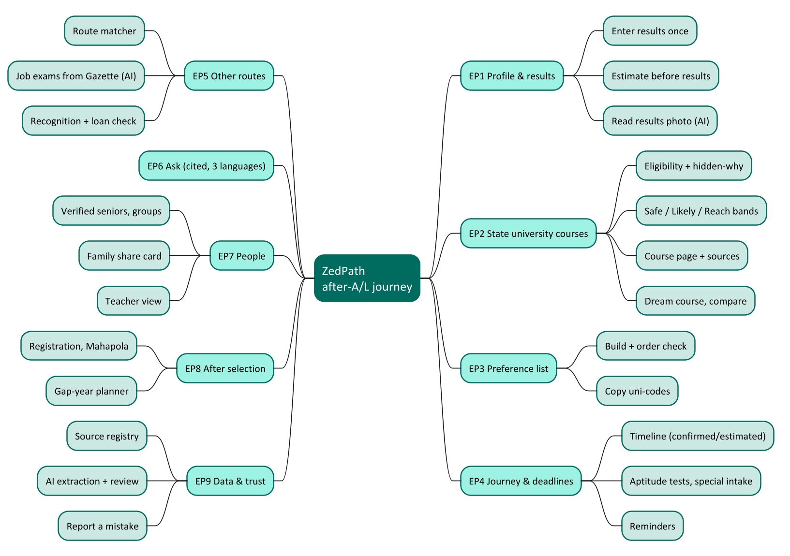

# Introduction

## Purpose

This document is the **product backlog** of ZedPath. It records who the product serves (personas), what they
need to do (user stories), how each need is verified (acceptance criteria), and in which order the needs are
delivered (priority and release). It is the source from which all later requirements, design and test
documents are derived.

## Scope

In scope: every capability of ZedPath for its six personas across nine epics, from entering A/L results
to registering at a university or taking another route. Out of scope: the internal design of those
capabilities (see ZP-DOC-05 and ZP-DOC-06) and the detailed system requirements (see ZP-DOC-03).

## Intended audience

Table: Intended readers and what they use this document for

| Reader | Uses this document to |
|---|---|
| Product owner | Approve scope, priorities and release content |
| Buildathon judges and mentors | Understand what is being built and why, traced to evidence |
| Developers | Know exactly what "done" means for each story |
| Testers | Turn acceptance criteria into acceptance tests (ZP-DOC-08) |

## Relationship to other documents

Table: Position of this document in the ZedPath document set

| Document | Relationship |
|---|---|
| ZP-DOC-01 Vision and Scope | Parent. Defines the problem, goals and boundaries that these stories refine |
| ZP-DOC-03 Software Requirements Specification | Child. Each functional requirement traces back to a story ID defined here |
| ZP-DOC-04 Use Case Model | Child. Use cases group related stories into actor goals |
| ZP-DOC-05 Data Design | Child. Nouns in the stories become entities; acceptance criteria become constraints |
| ZP-DOC-06 Software Architecture | Child. Stories decide which Cloudflare service serves which need |
| ZP-DOC-08 Test Plan | Child. Each acceptance criterion becomes at least one test case |

## Conventions

- **Story format:** **As a** &lt;persona&gt;, **I want** &lt;capability&gt;, **so that** &lt;benefit&gt;.
- **Quality bar:** every story meets INVEST (Independent, Negotiable, Valuable, Estimable, Small, Testable).
- **Acceptance criteria** use *Given / When / Then* and are numbered **AC-nnn.k**, where *nnn* is the story
  number. Each one is independently testable.
- **Priority (MoSCoW):** **Must** (release fails without it), **Should** (important, not vital),
  **Could** (desirable), **Won't** (agreed out of this release).
- **Size:** story points on a Fibonacci scale (1, 2, 3, 5, 8, 13). Points compare stories with each other
  (a 5 is about five times a 1); they are not hours.
- **Release:** **R1** = Gate 3 build (due 11 October 2026); **R2** = after the buildathon.
- **Story IDs** are **US-enn**: *e* is the epic number, *nn* the story within it. IDs are never reused.

## Sources of evidence

Stories are grounded in the Gate 1 research, not invented. The codes below are cited on every story.

Table: Evidence sources and what each one showed

| Code | Evidence | What it told us |
|---|---|---|
| E1 | Current A/L student, Commerce, Colombo | Doesn't know the Z-score needed or how applying works |
| E2 | Private-university undergraduate, Gampaha | "No proper place to get the information"; applied only to nearby universities |
| E3 | Alternate path, Biological Science | Didn't know the Gazette job-exam route existed |
| E4 | Private-university undergraduate, Matara | Preference-list mistake: "I missed one course... life altering" |
| E5 | Foreign scholarship holder, Kurunegala | Found the route by luck; asked for "all the options... and the steps" |
| E6 | State-university undergraduate, IT | Wanted to see the curriculum; warned that seniors must be verified |
| T1 | Tool test, 27 September 2026 | findmydegree, Unicompass, induwara and ThuSh LK check no grade rules, order or deadlines |
| S | Concept preview (33 screens) | The intended experience, screen by screen |
| Deck S7 | Gate 1 deck, Section 7 | How the product keeps AI-extracted facts honest |

## Product principles

Every story must respect these principles. ZP-DOC-03 restates them as testable non-functional requirements.

1. **Every fact has a source.** Every cut-off, rule, date and fee links to the official page it came from.
2. **Honest about uncertainty.** The app never says "you will get in". Dates are *confirmed* or *estimated*.
3. **No account needed to explore.** Nothing personal is stored on the server without explicit consent.
4. **No paid placement.** No institution can pay to rank higher or look more recognised.
5. **Three languages.** Sinhala, Tamil and English throughout.
6. **Works on a low-cost phone on mobile data.**
7. **Runs within the Cloudflare free plan.** Any story that would need a paid service is redesigned or deferred.

# Personas

## P1 Kavindu: the student who just got results (primary persona)

| | |
|---|---|
| Profile | Physical Science stream, Kurunegala district, Z-score 1.4821. Combined Maths B, Physics C, ICT A |
| Situation | Qualified for university, but Engineering is out of reach. Weighing a state IT course, a private IT degree and the Customs exam at the same time |
| Support | No career counsellor at school. A tuition teacher, two seniors and a Facebook group |
| Family | First in the family to apply to university. Can manage about Rs 1M for a private degree, only with a loan |
| Device | Mid-range Android phone, prepaid mobile data, prefers Sinhala |
| Biggest fear | One mistake (order, deadline, ineligible choice) that costs a year |

## P2 Nimesha: the student who has not sat the exam yet

Commerce stream, sitting the A/L next year (like E1). Wants to know what Z-score her target course has
needed, and what other routes exist (CIMA, CA), before results day.

## P3 Mr. Bandara: the parent

Kavindu's father. Not comfortable in English, uses WhatsApp daily. Wants a clear summary of the options and
their cost, in Sinhala, not an app to learn.

## P4 Ms. Perera: the teacher or counsellor

Teaches Grade 13 Combined Maths to 38 students. Wants to see who is at risk (no Safe choice, no list started)
before the UGC deadline, without collecting every student's data by hand.

## P5 Sahan: the verified senior

Third-year Computer Science student at Ruhuna. Happy to answer questions about his course, but only in a space
where people know he is a real student (E6's warning).

## P6 The curator: the ZedPath data reviewer

Initially the product owner. Loads official documents, reviews AI-extracted facts the system is unsure about,
and fixes reported mistakes. Every published fact passes through this role or an automated two-model check.

## System actors

Table: System actors (non-human)

| Actor | Role |
|---|---|
| Scheduler | Runs the weekly Gazette scan and the daily reminder job |
| AI extractor | Reads handbooks, Gazettes and results photos; proposes structured facts with a confidence score and source page |
| AI checker | A second, independent model that agrees or disagrees with each extracted fact |

# Story map

The story map shows the nine epics along the student's journey. EP1 to EP6 form the core of the product,
EP7 and EP8 deepen it, and EP9 makes every fact trustworthy.

Table: Epic summary (verified by script against the stories in this document)

| Epic | Name | Stories | Points | Must | Primary persona |
|---|---|---|---|---|---|
| EP1 | Profile and results | 5 | 13 | 3 | P1, P2 |
| EP2 | State university course discovery | 8 | 29 | 4 | P1 |
| EP3 | Preference list | 4 | 12 | 3 | P1 |
| EP4 | Journey and deadlines | 6 | 18 | 3 | P1 |
| EP5 | Other routes | 7 | 26 | 3 | P1, P2 |
| EP6 | Ask, with sources | 4 | 16 | 2 | P1, P2 |
| EP7 | People around the student | 5 | 21 | 1 | P3, P4, P5 |
| EP8 | After selection | 4 | 10 | 0 | P1 |
| EP9 | Data and trust | 7 | 31 | 5 | P6 |
| | **Total** | **50** | **176** | **24** | |

# Epic EP1: Profile and results

| | |
|---|---|
| Goal | The student enters their situation once, in under a minute, and every screen uses it. |
| Evidence | E1, E5 ("Show all the options he can take after the Z-score is released"), S: Start screen. |

## US-101 Enter my results once

| Priority | Size | Release | Epic | Persona | Evidence |
|---|---|---|---|---|---|
| Must | 3 pts | R1 | EP1 | P1 | E1, E5, S |

> **As a** student who just got results, **I want** to enter my stream, district, Z-score and subject grades once,
**so that** every course and route I see is checked against my own results.

**Acceptance criteria**

- **AC-101.1** **Given** I open ZedPath for the first time, **when** I choose a stream, district, Z-score and three subject grades and tap *Show my options*, **then** I see my results screen within 2 seconds on a 3G connection.
- **AC-101.2** **Given** I enter a Z-score outside the valid range (−4.0000 to +4.0000) or with more than 4 decimals, **then** I see an inline error and cannot continue.
- **AC-101.3** **Given** my subjects do not form a valid combination for the chosen stream, **then** I am told which subject does not fit.
- **AC-101.4** **Given** I have entered my profile, **when** I close and reopen the app on the same device, **then** my profile is still there, and nothing was sent to the server for storage.

## US-102 Change my profile at any time

| Priority | Size | Release | Epic | Persona | Evidence |
|---|---|---|---|---|---|
| Must | 1 pt | R1 | EP1 | P1 | E1, E5, S |

> **As a** student, **I want** to edit or clear my profile, **so that** I can correct a mistake or try "what if" scenarios.

**Acceptance criteria**

- **AC-102.1** **Given** a saved profile, **when** I change any field, **then** all results recalculate immediately.
- **AC-102.2** **Given** a saved profile, **when** I tap *Clear my data*, **then** the profile is removed from the device and I return to the start screen.

## US-103 Estimate my Z-score before results

| Priority | Size | Release | Epic | Persona | Evidence |
|---|---|---|---|---|---|
| Should | 5 pts | R1 | EP1 | P2 | E1 |

> **As a** student who hasn't got results yet (P2), **I want** to enter the marks I expect and see an estimated
Z-score **range**, **so that** I can plan before results day.

**Acceptance criteria**

- **AC-103.1** **Given** I enter expected marks for my three subjects, **then** I see a range (e.g. 1.35 to 1.55), never a single number, labelled *Estimate*.
- **AC-103.2** **Given** an estimate is shown, **then** the screen explains that a Z-score depends on this year's candidates and names the years of data used.
- **AC-103.3** **Given** I use an estimated range, **then** course bands are computed from the *lower* end of the range and marked as based on an estimate.

## US-104 Read my results sheet from a photo

| Priority | Size | Release | Epic | Persona | Evidence |
|---|---|---|---|---|---|
| Should | 3 pts | R1 | EP1 | P1 | E1, E5, S |

> **As a** student, **I want** to photograph my results sheet instead of typing, **so that** I avoid typing mistakes.

**Acceptance criteria**

- **AC-104.1** **Given** I upload a clear photo of an A/L results sheet, **when** extraction completes, **then** the fields are filled in and shown to me to **confirm or correct** before they are used.
- **AC-104.2** **Given** extraction confidence is low for any field, **then** that field is highlighted for me to check.
- **AC-104.3** **Given** a photo was uploaded, **then** it is deleted from storage as soon as extraction finishes (verifiable in logs), and is never used for anything else.

## US-105 Use the app in my language

| Priority | Size | Release | Epic | Persona | Evidence |
|---|---|---|---|---|---|
| Must | 1 pt | R1 | EP1 | P1 | E1, E5, S |

> **As a** student, **I want** to switch between Sinhala, Tamil and English at any time, **so that** I understand every word.

**Acceptance criteria**

- **AC-105.1** **Given** any screen, **when** I switch language, **then** all interface text changes without losing my place.
- **AC-105.2** **Given** a fact whose official source exists only in one language, **then** the original-language source link is still shown.

# Epic EP2: State university course discovery

| | |
|---|---|
| Goal | Show every state-university course the student can actually reach, how likely it is, and why. |
| Evidence | E2, E4, T1 (no tool checks grade rules), S: Results, Course page, Subject check, Dream course, Compare. |

## US-201 See every course I am eligible for

| Priority | Size | Release | Epic | Persona | Evidence |
|---|---|---|---|---|---|
| Must | 5 pts | R1 | EP2 | P1 | E1, E2, T1 |

> **As a** student, **I want** to see all state-university courses my stream and subject grades make me eligible for,
**so that** I don't miss any (E2 applied only to nearby universities).

**Acceptance criteria**

- **AC-201.1** **Given** my profile, **then** I see the count and list of eligible course offerings (course × university).
- **AC-201.2** **Given** a course requires a subject I didn't take or a grade I didn't reach, **then** it is **not** in the eligible list.
- **AC-201.3** **Given** the handbook rule for a course is "C in Combined Maths **or** Physics", **when** I have a C in Physics only, **then** the course **is** eligible (the alternative is evaluated correctly).

## US-202 See why a course is hidden from me

| Priority | Size | Release | Epic | Persona | Evidence |
|---|---|---|---|---|---|
| Must | 2 pts | R1 | EP2 | P1 | T1 |

> **As a** student, **I want** to see which courses were hidden and the exact rule I failed, **so that** I trust the list.

**Acceptance criteria**

- **AC-202.1** **Given** some courses were excluded, **then** I see "N courses hidden", and each has a plain-language reason and a link to its handbook section.

## US-203 See Safe / Likely / Reach for each course

| Priority | Size | Release | Epic | Persona | Evidence |
|---|---|---|---|---|---|
| Must | 5 pts | R1 | EP2 | P1 | E1 |

> **As a** student, **I want** each eligible course banded Safe, Likely or Reach from several years of my district's
cut-offs, **so that** I understand my real chances rather than a yes/no from one year.

**Acceptance criteria**

- **AC-203.1** **Given** at least 3 years of district cut-offs for an offering, **then** the band is computed from where my Z-score sits within the historical range (see ZP-DOC-03 for the exact rule).
- **AC-203.2** **Given** fewer than 3 years of data, **then** the course is marked *Not enough history* rather than banded.
- **AC-203.3** **Given** any band is shown, **then** the gap to last year's cut-off is shown with its sign (e.g. +0.061) and the trend (rising, steady, jumpy).
- **AC-203.4** **Given** any band, **then** the wording never promises admission.

## US-204 Open a course page with sources

| Priority | Size | Release | Epic | Persona | Evidence |
|---|---|---|---|---|---|
| Must | 3 pts | R1 | EP2 | P1 | E6 |

> **As a** student, **I want** one page per course offering with its district cut-off history, duration, medium,
aptitude-test flag and what the first year teaches, **so that** I can decide with everything in one place (E6).

**Acceptance criteria**

- **AC-204.1** **Given** I open an offering, **then** I see a table of cut-offs by year for my district, with my Z-score in the last row.
- **AC-204.2** **Given** any number on the page, **then** it links to the source document and page it came from, with the date it was verified.

## US-205 Filter and sort courses

| Priority | Size | Release | Epic | Persona | Evidence |
|---|---|---|---|---|---|
| Should | 3 pts | R1 | EP2 | P1 | E2 |

> **As a** student, **I want** to filter by band, university, field and distance from home, **so that** a long list stays usable.

**Acceptance criteria**

- **AC-205.1** **Given** the results list, **when** I filter by band *Likely*, **then** only Likely offerings are shown and the count updates.

## US-206 Work backwards from a dream course

| Priority | Size | Release | Epic | Persona | Evidence |
|---|---|---|---|---|---|
| Should | 3 pts | R1 | EP2 | P1 | E2, E4, T1, S |

> **As a** student, **I want** to pick the course I really want and see how far away it is and the nearest open
alternatives, **so that** I can decide whether to aim higher or move on.

**Acceptance criteria**

- **AC-206.1** **Given** I choose a dream offering above my reach, **then** I see the gap to its lowest cut-off in the last 5 years and whether that gap is "small" or "large" (thresholds defined in ZP-DOC-03).
- **AC-206.2** **Then** I see up to 3 closest offerings in the same field that are Safe or Likely for me.

## US-207 Compare two courses

| Priority | Size | Release | Epic | Persona | Evidence |
|---|---|---|---|---|---|
| Could | 3 pts | R1 | EP2 | P1 | E2, E4, T1, S |

> **As a** student, **I want** two offerings side by side, **so that** I can choose between them.

**Acceptance criteria**

- **AC-207.1** **Given** I select two offerings, **then** I see band, length, medium, campus, extra steps (aptitude test) and trend in two columns.

## US-208 See what living there costs

| Priority | Size | Release | Epic | Persona | Evidence |
|---|---|---|---|---|---|
| Could | 5 pts | R2 | EP2 | P1, P3 | E2, E4, T1, S |

> **As a** student from a low-income family, **I want** the monthly living cost by campus, **so that** I can compare the real cost of each choice.

**Acceptance criteria**

- **AC-208.1** **Given** an offering, **then** I see board, food and travel estimates with the number of reports behind them and the date collected.

# Epic EP3: Preference list

| | |
|---|---|
| Goal | Prevent the single most expensive mistake: a badly ordered UGC preference list. |
| Evidence | E4 ("I missed one course... life altering"), T1 (no tool checks order), S: Preference list, UGC form. |

## US-301 Build my preference list

| Priority | Size | Release | Epic | Persona | Evidence |
|---|---|---|---|---|---|
| Must | 3 pts | R1 | EP3 | P1 | E4 |

> **As a** student, **I want** to add eligible offerings to a list and arrange them in the order I want them, **so that** I can prepare my UGC application.

**Acceptance criteria**

- **AC-301.1** **Given** an eligible offering, **when** I tap *Add to my list*, **then** it appears at the bottom of my list with its band and uni-code.
- **AC-301.2** **Given** my list, **when** I drag an item, **then** the order changes and is saved on my device.
- **AC-301.3** **Given** an offering I'm not eligible for, **then** it cannot be added.

## US-302 Get warned about a bad order

| Priority | Size | Release | Epic | Persona | Evidence |
|---|---|---|---|---|---|
| Must | 5 pts | R1 | EP3 | P1 | E4, T1 |

> **As a** student, **I want** to be warned when a Safe choice sits above a course I want more, **so that** I am not placed in it and locked out of my preferred course.

**Acceptance criteria**

- **AC-302.1** **Given** a Safe offering ranked above a Likely or Reach offering, **then** a warning explains, in plain words, that I'd be placed in the Safe one if I qualify for both.
- **AC-302.2** **Given** my list has no Safe choice at all, **then** I am warned that I may not be placed anywhere.
- **AC-302.3** **Given** I tap *Fix order for me*, **then** a suggested order is shown that keeps my most-wanted choices first and Safe choices last, and I must confirm it.

## US-303 Copy uni-codes in order

| Priority | Size | Release | Epic | Persona | Evidence |
|---|---|---|---|---|---|
| Must | 1 pt | R1 | EP3 | P1 | E4 |

> **As a** student, **I want** to copy my uni-codes in the right order, **so that** I can enter them into the UGC online form without mistakes.

**Acceptance criteria**

- **AC-303.1** **Given** my list, **when** I tap *Copy uni-codes*, **then** the clipboard contains the codes in list order, one per line.

## US-304 Learn the UGC form step by step

| Priority | Size | Release | Epic | Persona | Evidence |
|---|---|---|---|---|---|
| Should | 3 pts | R1 | EP3 | P1 | E4 |

> **As a** first-generation applicant, **I want** the official application explained step by step with common mistakes, **so that** my application isn't sent back.

**Acceptance criteria**

- **AC-304.1** **Given** I open the guide, **then** I see each step of the official process with the most common mistake for that step, linked to the official instructions.

# Epic EP4: Journey and deadlines

| | |
|---|---|
| Goal | The student never misses a date, including the ones nobody tells them about. |
| Evidence | E1, E3, S: Journey, Aptitude tests, Special intake, Timeline. |

## US-401 See my journey with the next step first

| Priority | Size | Release | Epic | Persona | Evidence |
|---|---|---|---|---|---|
| Must | 3 pts | R1 | EP4 | P1 | E5 |

> **As a** student, **I want** one screen showing every stage from results to registration, with the next action on top, **so that** I always know what to do now.

**Acceptance criteria**

- **AC-401.1** **Given** today's date and my profile, **then** stages before today are marked done, and the next open deadline is shown at the top with days remaining.

## US-402 Know whether a date is confirmed or estimated

| Priority | Size | Release | Epic | Persona | Evidence |
|---|---|---|---|---|---|
| Must | 2 pts | R1 | EP4 | P1 | T1 |

> **As a** student, **I want** every date marked *confirmed* (with source) or *estimated* (with basis), **so that** I know how much to rely on it.

**Acceptance criteria**

- **AC-402.1** **Given** a deadline from an official notice, **then** it is marked Confirmed and links to the notice.
- **AC-402.2** **Given** a deadline inferred from previous years, **then** it is marked Estimated and states "based on last year: June".

## US-403 Be told about aptitude tests for courses on my list

| Priority | Size | Release | Epic | Persona | Evidence |
|---|---|---|---|---|---|
| Must | 3 pts | R1 | EP4 | P1 | T1 |

> **As a** student, **I want** to know if any course on my list needs a separate aptitude test, and its application date, **so that** I don't lose the course (screen S: "I missed the architecture aptitude test").

**Acceptance criteria**

- **AC-403.1** **Given** my list includes an offering with an aptitude test, **then** the journey shows a separate step for that test's application and test date.

## US-404 Get reminders before deadlines

| Priority | Size | Release | Epic | Persona | Evidence |
|---|---|---|---|---|---|
| Should | 5 pts | R1 | EP4 | P1 | E1, E3, S |

> **As a** student, **I want** my deadlines in my phone's calendar or as notifications, **so that** I'm reminded 7 days and 1 day before each deadline on my journey.

**Acceptance criteria**

- **AC-404.1** **Given** my journey, **when** I tap *Add to calendar*, **then** I receive a calendar file (.ics) with every deadline and alarms 7 days and 1 day before each.
- **AC-404.2** **Given** a browser that supports web push, **when** I turn on notifications, **then** I receive a notification 7 days and 1 day before each deadline on my journey.
- **AC-404.3** **Given** I turn notifications off, **then** my push subscription is deleted from the server and no further notifications are sent.
- **AC-404.4** **Given** I never turn notifications on, **then** no identifier of mine exists on the server.

> **Note:** Email reminders were dropped in v0.9. The Cloudflare free plan does not allow Workers to send email
> to arbitrary recipients (Cloudflare Email Service pricing, retrieved 5 October 2026). Calendar files and web
> push are free and need no contact details. See ZP-DOC-06.

## US-405 Check whether a special intake applies to me

| Priority | Size | Release | Epic | Persona | Evidence |
|---|---|---|---|---|---|
| Could | 2 pts | R2 | EP4 | P1 | E1, E3, S |

> **As a** student with a special circumstance, **I want** to check the special intake categories, **so that** I don't miss a second door.

**Acceptance criteria**

- **AC-405.1** **Given** I answer the category questions, **then** I see which categories may apply, each linked to its handbook section.

## US-406 Add my own steps to the journey

| Priority | Size | Release | Epic | Persona | Evidence |
|---|---|---|---|---|---|
| Could | 3 pts | R2 | EP4 | P1 | E1, E3, S |

> **As a** student, **I want** to add a route's dates (e.g. a job exam) to my journey, **so that** everything is on one timeline.

**Acceptance criteria:** to be detailed when the story is scheduled (R2 backlog refinement).

# Epic EP5: Other routes

| | |
|---|---|
| Goal | Make every path visible, not just the state university. |
| Evidence | E1 (CIMA), E3 (Gazette, regret), E5 (luck), deck: 42,937 places for 176,527 qualified. |

## US-501 See every route my results open

| Priority | Size | Release | Epic | Persona | Evidence |
|---|---|---|---|---|---|
| Must | 5 pts | R1 | EP5 | P1 | E1, E3, E5 |

> **As a** student, **I want** to see all non-UGC routes my results qualify me for, grouped by type, **so that** I have a real Plan B.

**Acceptance criteria**

- **AC-501.1** **Given** my profile, **then** I see routes in groups: private and non-state degrees, higher national diplomas, professional qualifications, vocational courses, job exams, study abroad and a retry.
- **AC-501.2** **Given** a route requires something I don't meet (e.g. Biology stream for nursing), **then** it is shown as *Not open to you* with the reason.

## US-502 Open a route's details

| Priority | Size | Release | Epic | Persona | Evidence |
|---|---|---|---|---|---|
| Must | 3 pts | R1 | EP5 | P1 | E1, E3, E5 |

> **As a** student, **I want** the entry requirements, duration, rough cost, intake timing and source for each route, **so that** I can compare it with a state course.

**Acceptance criteria**

- **AC-502.1** **Given** a route, **then** every requirement, fee and date has a source link and a verified date.

## US-503 Be alerted about job exams I qualify for

| Priority | Size | Release | Epic | Persona | Evidence |
|---|---|---|---|---|---|
| Must | 5 pts | R1 | EP5 | P1 | E3 |

> **As a** student (E3), **I want** to be told when a government exam I qualify for is announced in the Gazette, **so that** I don't find out too late.

**Acceptance criteria**

- **AC-503.1** **Given** a new Gazette notice is processed, **when** it announces an exam whose education and age rules I meet, **then** it appears in my Alerts with the closing date and a link to the notice.
- **AC-503.2** **Given** the notice's details were extracted with low confidence, **then** it is not shown until a curator has reviewed it.

## US-504 Check whether a degree is recognised

| Priority | Size | Release | Epic | Persona | Evidence |
|---|---|---|---|---|---|
| Should | 5 pts | R2 | EP5 | P1, P3 | E1, E3, E5 |

> **As a** family about to pay for a private degree, **I want** to check whether the awarding university and the local programme are recognised, **so that** we don't lose years and money.

**Acceptance criteria**

- **AC-504.1** **Given** a programme, **then** I see the status of each check (awarding university listed, local programme approved, loan-scheme eligible), each with its source and date checked.

## US-505 Check the interest-free loan scheme

| Priority | Size | Release | Epic | Persona | Evidence |
|---|---|---|---|---|---|
| Should | 3 pts | R2 | EP5 | P1 | E1, E3, E5 |

> **As a** student, **I want** to check if I meet the basic conditions of the government interest-free loan for approved non-state degrees, **so that** I know if a private degree is affordable.

**Acceptance criteria:** to be detailed when the story is scheduled (R2 backlog refinement).

## US-506 See scholarships abroad

| Priority | Size | Release | Epic | Persona | Evidence |
|---|---|---|---|---|---|
| Could | 3 pts | R2 | EP5 | P1 | E5 |

> **As a** student (E5), **I want** the government scholarships open to school leavers, with usual timing and what they ask for, **so that** finding one isn't luck.

**Acceptance criteria:** to be detailed when the story is scheduled (R2 backlog refinement).

## US-507 Understand what retrying would take

| Priority | Size | Release | Epic | Persona | Evidence |
|---|---|---|---|---|---|
| Should | 2 pts | R1 | EP5 | P1 | E1, E3, E5 |

> **As a** student who missed a dream course, **I want** an honest view of the gap, the attempt count and the alternatives, **so that** I decide with real numbers.

**Acceptance criteria**

- **AC-507.1** **Given** a dream offering, **then** I see the Z-score gap, my attempt number out of three, and the routes I could take while preparing.

# Epic EP6: Ask, with sources

| | |
|---|---|
| Goal | Answer "can I, with my grades?" in the student's language, citing the source, and refuse to guess. |
| Evidence | E2 ("No one can really read the campus book"), deck Section 7, S: Ask. |

## US-601 Ask a question in my language

| Priority | Size | Release | Epic | Persona | Evidence |
|---|---|---|---|---|---|
| Must | 5 pts | R1 | EP6 | P1 | E2 |

> **As a** student, **I want** to ask a question in Sinhala, Tamil or English and get an answer in the same language, **so that** I understand it.

**Acceptance criteria**

- **AC-601.1** **Given** a question in Sinhala, **then** the answer is in Sinhala.
- **AC-601.2** **Given** the question relates to my eligibility, **then** the answer uses my profile (stream, grades, district, Z-score).

## US-602 Every answer cites its source

| Priority | Size | Release | Epic | Persona | Evidence |
|---|---|---|---|---|---|
| Must | 3 pts | R1 | EP6 | P1 | Deck S7 |

> **As a** student, **I want** each answer to link to the official page it came from, **so that** I can check it.

**Acceptance criteria**

- **AC-602.1** **Given** any factual answer, **then** it shows at least one source chip linking to the document and page.
- **AC-602.2** **Given** no source supports an answer, **then** the assistant says it does not know and points to where to ask (e.g. the UGC hotline), instead of guessing.

## US-603 The assistant won't predict the future

| Priority | Size | Release | Epic | Persona | Evidence |
|---|---|---|---|---|---|
| Should | 3 pts | R1 | EP6 | P1 | E2, S |

> **As a** student, **I want** the assistant to say plainly when nobody can know something (e.g. this year's cut-off), **so that** I'm not misled.

**Acceptance criteria**

- **AC-603.1** **Given** a question asking for a future cut-off or a guarantee, **then** the answer states it cannot be known and offers the historical pattern instead.

## US-604 Turn an answer into an action

| Priority | Size | Release | Epic | Persona | Evidence |
|---|---|---|---|---|---|
| Could | 5 pts | R2 | EP6 | P1 | E2, S |

> **As a** student, **I want** quick actions under an answer (add to list, add to journey, compare), **so that** I act straight away.

**Acceptance criteria:** to be detailed when the story is scheduled (R2 backlog refinement).

# Epic EP7: People around the student

| | |
|---|---|
| Goal | The student doesn't decide alone, and the people who help them have what they need. |
| Evidence | E6 (verified seniors), deck: decisions made with parents, teachers, seniors. |

## US-701 Share a summary with my family

| Priority | Size | Release | Epic | Persona | Evidence |
|---|---|---|---|---|---|
| Must | 3 pts | R1 | EP7 | P3 | E6 |

> **As a** student, **I want** to share a one-card summary of my options in Sinhala, Tamil or English to WhatsApp, **so that** my parents (P3) understand without installing anything.

**Acceptance criteria**

- **AC-701.1** **Given** my results, **when** I tap *Share*, **then** a card image and a short text are produced in the chosen language and handed to the phone's share sheet.
- **AC-701.2** **Given** a shared card, **then** it contains no Z-score or name unless I choose to include them.

## US-702 Ask a verified senior

| Priority | Size | Release | Epic | Persona | Evidence |
|---|---|---|---|---|---|
| Should | 5 pts | R2 | EP7 | P1 | E6 |

> **As a** student, **I want** to ask questions to students already in the course, **so that** I hear what it's really like.

**Acceptance criteria**

- **AC-702.1** **Given** a senior's answer, **then** it shows their course, year and a *verified* badge.

## US-703 Become a verified senior

| Priority | Size | Release | Epic | Persona | Evidence |
|---|---|---|---|---|---|
| Should | 5 pts | R2 | EP7 | P5 | E6 |

> **As a** university student (P5), **I want** to prove that I'm enrolled, **so that** I can answer questions with a verified badge.

**Acceptance criteria**

- **AC-703.1** **Given** I sign in with my university Google account, **when** its domain is on the recognised university-domain list, **then** I am marked verified for that university.
- **AC-703.2** **Given** my university does not use Google accounts, **when** I submit proof of enrolment, **then** a curator approves or rejects it and the proof is deleted after the decision.
- **AC-703.3** **Given** a verified senior is reported for misconduct, **then** the curator can revoke the badge.

## US-704 Join a group for my batch and target course

| Priority | Size | Release | Epic | Persona | Evidence |
|---|---|---|---|---|---|
| Could | 5 pts | R2 | EP7 | P1 | E6 |

> **As a** student, **I want** to join a group for my batch and target course, **so that** I can share updates (e.g. second-round notices).

**Acceptance criteria:** to be detailed when the story is scheduled (R2 backlog refinement).

## US-705 See my class's progress as a teacher

| Priority | Size | Release | Epic | Persona | Evidence |
|---|---|---|---|---|---|
| Could | 3 pts | R2 | EP7 | P4 | E6 |

> **As a** teacher (P4), **I want** a class view of who has a Safe choice, who only has Reach choices and who hasn't started, **so that** I can help the right students before the deadline.

**Acceptance criteria**

- **AC-705.1** **Given** students choose to share with my class code, **then** I see aggregate counts and the names of only those who shared.

# Epic EP8: After selection

| | |
|---|---|
| Goal | Carry the student from "selected" to the first lecture, and use the long wait well. |
| Evidence | S: Registration, Mahapola, First weeks, Gap planner, Papers ready. |

## US-801 Get my registration checklist

| Priority | Size | Release | Epic | Persona | Evidence |
|---|---|---|---|---|---|
| Could | 3 pts | R2 | EP8 | P1 | S |

> **As a** selected student, **I want** the university's registration list as a checklist with where to get each item, **so that** I register on time.

**Acceptance criteria:** to be detailed when the story is scheduled (R2 backlog refinement).

## US-802 Check Mahapola and bursary

| Priority | Size | Release | Epic | Persona | Evidence |
|---|---|---|---|---|---|
| Could | 2 pts | R2 | EP8 | P1, P3 | S |

> **As a** student from a low-income family, **I want** to know whether I may qualify and what slows applications down, **so that** I start early.

**Acceptance criteria:** to be detailed when the story is scheduled (R2 backlog refinement).

## US-803 Plan the gap year

| Priority | Size | Release | Epic | Persona | Evidence |
|---|---|---|---|---|---|
| Could | 3 pts | R2 | EP8 | P1 | S |

> **As a** student facing months before lectures, **I want** a plan of skills and courses near me that fit my course, **so that** I don't lose the year.

**Acceptance criteria:** to be detailed when the story is scheduled (R2 backlog refinement).

## US-804 Keep my documents ready

| Priority | Size | Release | Epic | Persona | Evidence |
|---|---|---|---|---|---|
| Could | 2 pts | R2 | EP8 | P1 | S |

> **As a** student, **I want** a checklist of documents every route will ask for, **so that** nothing later is held up.

**Acceptance criteria:** to be detailed when the story is scheduled (R2 backlog refinement).

# Epic EP9: Data and trust

| | |
|---|---|
| Goal | Every fact in ZedPath is sourced, checked and correctable. This epic makes the rest believable. |
| Evidence | deck Section 7 ("How we keep it honest"), E6 (verification), product principle 1. |

## US-901 Register an official source

| Priority | Size | Release | Epic | Persona | Evidence |
|---|---|---|---|---|---|
| Must | 3 pts | R1 | EP9 | P6 | Deck S7 |

> **As a** curator, **I want** to upload an official document (handbook, cut-off table, Gazette) with its publisher, issue date and language, **so that** facts can cite it.

**Acceptance criteria**

- **AC-901.1** **Given** I upload a PDF, **then** it is stored unchanged, fingerprinted (SHA-256), and gets a source ID.
- **AC-901.2** **Given** the same file is uploaded twice, **then** the duplicate is detected by fingerprint.

## US-902 Extract rules from the handbook with AI

| Priority | Size | Release | Epic | Persona | Evidence |
|---|---|---|---|---|---|
| Must | 8 pts | R1 | EP9 | P6 | Deck S7 |

> **As a** curator, **I want** the AI extractor to turn each course's entry clause into a structured rule with the page number, **so that** 255+ course rules don't have to be typed by hand every year.

**Acceptance criteria**

- **AC-902.1** **Given** a handbook source, **when** extraction runs, **then** each course produces a candidate rule with confidence and source page.
- **AC-902.2** **Given** a candidate rule, **then** an independent AI checker marks it agree or disagree.
- **AC-902.3** **Given** both models agree with high confidence, **then** the rule is published automatically; otherwise it goes to the review queue.

## US-903 Review uncertain facts

| Priority | Size | Release | Epic | Persona | Evidence |
|---|---|---|---|---|---|
| Must | 5 pts | R1 | EP9 | P6 | Deck S7 |

> **As a** curator, **I want** a review queue showing the extracted fact next to the source page, **so that** I can approve, correct or reject quickly.

**Acceptance criteria**

- **AC-903.1** **Given** a queued item, **then** I see the original text, the proposed structured fact, both models' verdicts and the page.
- **AC-903.2** **Given** I approve or correct it, **then** it is published with my review recorded (who, when, what changed).

## US-904 Scan the Gazette every week

| Priority | Size | Release | Epic | Persona | Evidence |
|---|---|---|---|---|---|
| Must | 5 pts | R1 | EP9 | System | E3, Deck S7 |

> **As a** scheduler, **I want** to fetch new Gazette issues each week, classify notices and extract exam details, **so that** job-exam alerts are timely.

**Acceptance criteria**

- **AC-904.1** **Given** the weekly run, **then** each new issue is stored, each relevant notice yields exam name, eligibility, age limit and closing date with confidence, and the run is logged with counts.
- **AC-904.2** **Given** a run fails, **then** it retries automatically and the failure is visible to the curator.

## US-905 Report a mistake

| Priority | Size | Release | Epic | Persona | Evidence |
|---|---|---|---|---|---|
| Must | 2 pts | R1 | EP9 | P1 | Deck S7 |

> **As a** student, **I want** to report a wrong fact with one tap, **so that** it gets fixed for everyone.

**Acceptance criteria**

- **AC-905.1** **Given** any fact, **when** I tap *Report a mistake* and add an optional note, **then** a report is created linked to that fact, and the curator sees it in the queue.

## US-906 Keep a history of every change

| Priority | Size | Release | Epic | Persona | Evidence |
|---|---|---|---|---|---|
| Should | 3 pts | R1 | EP9 | P6 | Deck S7 |

> **As a** curator, **I want** every published fact to keep its previous versions, **so that** we can explain and undo changes.

**Acceptance criteria:** to be detailed when the story is scheduled (R2 backlog refinement).

## US-907 Protect the app from abuse

| Priority | Size | Release | Epic | Persona | Evidence |
|---|---|---|---|---|---|
| Should | 5 pts | R1 | EP9 | Owner | E6 |

> **As the** product owner, **I want** bot protection on public forms and rate limits on AI features, **so that** the free tier isn't exhausted by abuse.

**Acceptance criteria**

- **AC-907.1** **Given** a form submission (report, reminder sign-up, question), **then** a bot check is passed first.
- **AC-907.2** **Given** a client exceeds the per-minute limit on Ask, **then** further requests get a friendly "slow down" response.

# Release plan

## Release R1: Gate 3 build (due 11 October 2026)

R1 contains every **Must** story plus the **Should** and **Could** stories marked R1. The Gate 3 demonstration
shows R1 end to end: results in, eligible courses with bands and reasons, a preference list with order
checks, a journey with aptitude tests, other routes and job-exam alerts, cited answers in three languages and
a shareable family card, all backed by sourced data and an AI extraction pipeline with human review.

Table: Release R1 content by priority

| Priority | Stories | Points |
|---|---:|---:|
| Must | 24 | 84 |
| Should | 10 | 35 |
| Could | 1 | 3 |
| **R1 total** | **35** | **122** |

## Release R2: after the buildathon

The remaining 15 stories (54 points: 4 Should, 11 Could): recognition and loan checks, cost of living,
verified seniors and groups, teacher view, the after-selection epic, special intake, custom journey steps
and answer actions.

## Walking skeleton

The first deployable slice is built before anything else. It proves the architecture end to end with real
plumbing and sample data: **US-101 → US-201 → US-203 → US-204**, reading from D1, served from Cloudflare,
in one language. Every later story is added to a version that already works.

# Definition of Ready and Definition of Done

## Definition of Ready

A story may enter development when it has an ID, persona, narrative, numbered acceptance criteria, priority
and size; the data it needs exists in ZP-DOC-05; and no open question remains.

## Definition of Done

A story counts as delivered only when all of the following hold:

1. Every acceptance criterion passes as an automated test or a recorded manual test (ZP-DOC-08).
2. Business rules are enforced on the server, not only hidden in the interface.
3. Every displayed fact links to its source.
4. The screen works at 360 px width and on a throttled 3G network profile.
5. All interface text exists in Sinhala, Tamil and English.
6. It stays within the Cloudflare free-plan budget in ZP-DOC-06.
7. The change is committed and pushed to the public repository with a descriptive message, and WORKLOG.md is updated.

# Traceability: evidence to stories

Table: Evidence-to-story traceability matrix

| Evidence | Stories it drives |
|---|---|
| E1 (doesn't know Z-score needed, CIMA unknown) | US-103, US-201, US-203, US-501 |
| E2 (no proper place; applied only nearby) | US-201, US-205, US-601 |
| E3 (Gazette unknown; regret) | US-503, US-904, US-501 |
| E4 (preference list mistake) | US-301, US-302, US-303, US-304 |
| E5 (options found by luck) | US-501, US-506, US-401 |
| E6 (curriculum; verified seniors) | US-204, US-702, US-703 |
| T1 (no grade, order or deadline checks) | US-201, US-202, US-302, US-402, US-403 |
| Deck Section 7 (how we keep it honest) | US-602, US-901 to US-906 |

# Glossary {.appendix}

Table: Terms and abbreviations used in this document

| Term | Meaning |
|---|---|
| A/L | G.C.E. Advanced Level examination, the university entrance examination in Sri Lanka |
| Aptitude test | A separate test some university courses hold on their own dates (e.g. Architecture) |
| Band | ZedPath's label for a course relative to the student's Z-score: Safe, Likely or Reach |
| Cut-off | The lowest Z-score admitted to a course offering in a district in a given intake year |
| District quota | The share of places allocated by district; the cut-off differs by district |
| Gazette | The Government Gazette of Sri Lanka, where government job examinations are announced |
| INVEST | Independent, Negotiable, Valuable, Estimable, Small, Testable: quality criteria for stories |
| Mahapola | A government scholarship paid to eligible state-university students |
| MoSCoW | Must, Should, Could, Won't: a prioritisation method from DSDM |
| Offering | A course at a specific university, identified by its uni-code |
| UGC | University Grants Commission, which runs state-university admission |
| Uni-code | The code a student enters on the UGC application for a course offering |
| Z-score | A standardised score that combines a student's three A/L subject results |

# References {.appendix}

Table: Documents referred to in this document

| Ref | Document |
|---|---|
| [1] | Team Kestrel, *Gate 1 Problem and Proof*, IntelliCon '26 Buildathon, September 2026 |
| [2] | ZedPath concept preview, 33 screens (claude.ai artifact), October 2026 |
| [3] | M. Cohn, *User Stories Applied: For Agile Software Development*, Addison-Wesley, 2004 |
| [4] | B. Wake, *INVEST in Good Stories, and SMART Tasks*, 2003 |
| [5] | DSDM Consortium, *The DSDM Agile Project Framework*, MoSCoW prioritisation |
| [6] | ISO/IEC/IEEE 29148:2018, *Systems and software engineering: Life cycle processes, Requirements engineering* |
| [7] | ZP-DOC-00, *ZedPath Documentation Standard* |
| [8] | Cloudflare, *Workers platform limits and pricing*, developers.cloudflare.com, retrieved 5 October 2026 |
