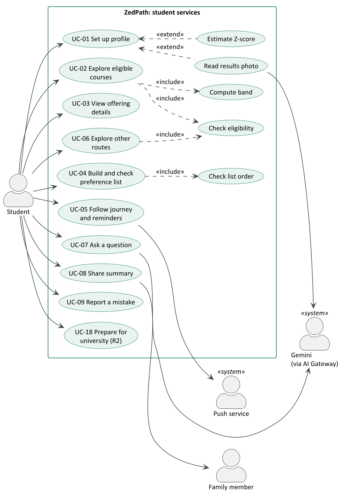
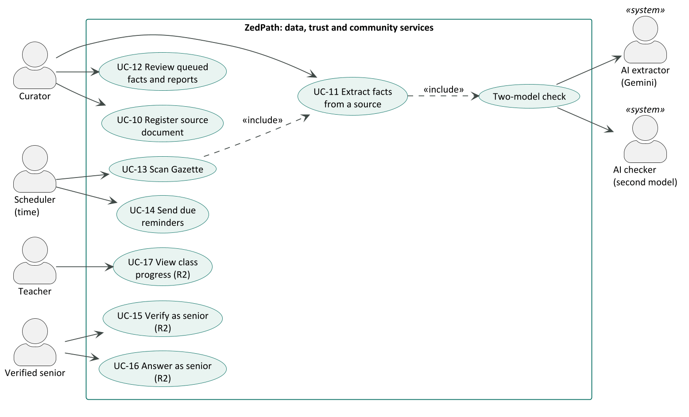
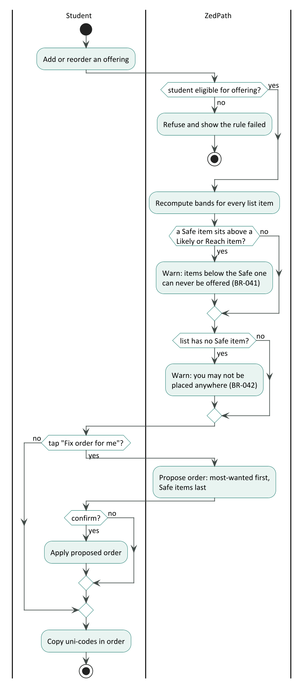
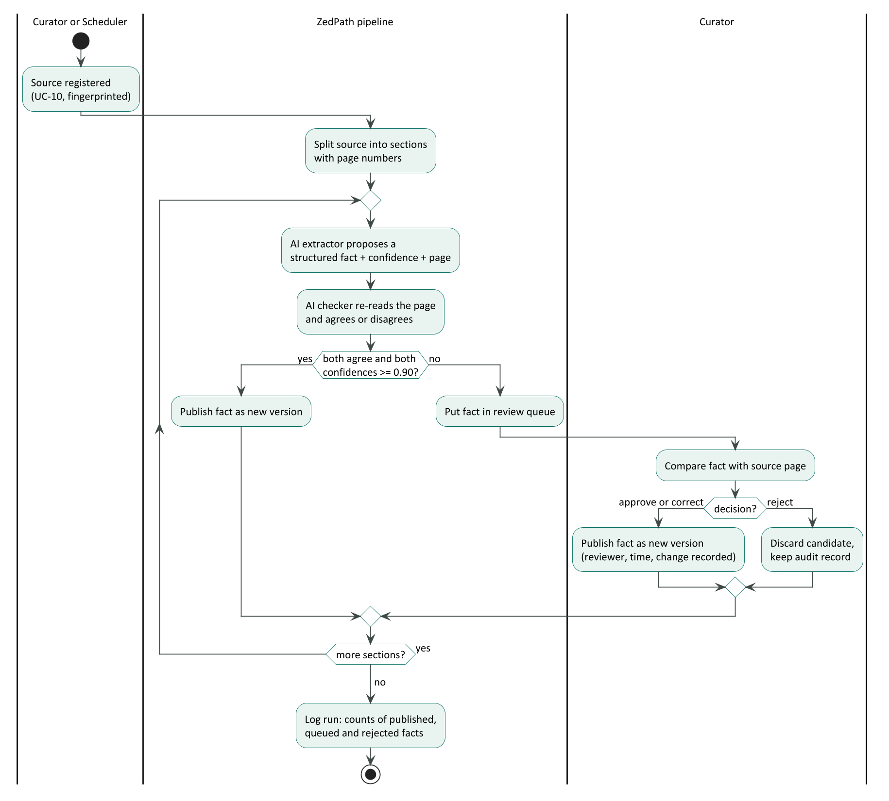

# Introduction

## Purpose

This document describes how each actor uses ZedPath to reach a goal. Where the user stories (ZP-DOC-02) say
*what* a user needs and the SRS (ZP-DOC-03) says *what the system shall do*, the use cases describe the
**interaction step by step**, including what happens when things go wrong. They are the basis for the screen
flows (ZP-DOC-07), the API design (ZP-DOC-06) and the system tests (ZP-DOC-08).

## Scope

Eighteen use cases covering Releases R1 and R2. Seven are written in Cockburn's *fully dressed* format
because they carry the main risk or value; the rest are given in *brief* format.

## Intended audience

Developers, testers, interface designers and reviewers.

## Relationship to other documents

Table: Position of this document in the ZedPath document set

| Document | Relationship |
|---|---|
| ZP-DOC-03 SRS | Parent. Each use case realises a group of functional requirements (listed per use case) |
| ZP-DOC-05 Data Design | Child. Nouns in the use cases name the entities |
| ZP-DOC-07 UI/UX Specification | Child. Main scenarios become screen flows |
| ZP-DOC-08 Test Plan | Child. Main scenarios and extensions become system test cases |

## Conventions

- Use case IDs are **UC-nn**. Goal level follows Cockburn: **user goal** (sea level) unless stated;
  **subfunction** for included steps.
- In scenarios, numbered steps are the main success path; extensions are numbered by the step they branch
  from (for example *3a*).
- *The system* means ZedPath.

# Actors

Table: Actors and their goals

| Actor | Type | Goals |
|---|---|---|
| Student (P1, P2) | Primary, human | Find every reachable path, avoid costly mistakes, never miss a deadline |
| Family member (P3) | Secondary, human | Receive a clear summary in their language |
| Teacher (P4) | Primary, human (R2) | See which students need help |
| Verified senior (P5) | Primary, human (R2) | Help juniors in a trusted space |
| Curator (P6) | Primary, human | Keep every published fact correct and sourced |
| Scheduler | Primary, time | Run weekly Gazette scans and daily reminders |
| AI extractor (Gemini via AI Gateway) | Supporting, system | Propose structured facts from documents and photos; draft answers |
| AI checker (second model) | Supporting, system | Independently agree or disagree with each extracted fact |
| Push service | Supporting, system | Deliver web-push reminders to the student's browser |

# Use case diagrams

# Use case catalogue

Table: Use case catalogue with level, release and realised requirements

| ID | Use case | Primary actor | Level | Release | Requirements |
|---|---|---|---|---|---|
| UC-01 | Set up profile | Student | User goal | R1 | FR-101 to FR-113 |
| UC-02 | Explore eligible courses | Student | User goal | R1 | FR-201 to FR-207, FR-210 to FR-213 |
| UC-03 | View offering details | Student | User goal | R1 | FR-208, FR-209, FR-214 |
| UC-04 | Build and check preference list | Student | User goal | R1 | FR-301 to FR-308 |
| UC-05 | Follow journey and reminders | Student | User goal | R1 | FR-401 to FR-408 |
| UC-06 | Explore other routes | Student | User goal | R1 | FR-501 to FR-508 |
| UC-07 | Ask a question | Student | User goal | R1 | FR-601 to FR-606, FR-913 |
| UC-08 | Share summary | Student | User goal | R1 | FR-701, FR-702 |
| UC-09 | Report a mistake | Student | Subfunction | R1 | FR-910, FR-912 |
| UC-10 | Register source document | Curator | User goal | R1 | FR-901, FR-902 |
| UC-11 | Extract facts from a source | Curator, Scheduler | User goal | R1 | FR-903 to FR-905 |
| UC-12 | Review queued facts and reports | Curator | User goal | R1 | FR-906, FR-907, FR-911 |
| UC-13 | Scan Gazette | Scheduler | User goal | R1 | FR-503, FR-504, FR-908, FR-909 |
| UC-14 | Send due reminders | Scheduler | User goal | R1 | FR-405, FR-406 |
| UC-15 | Verify as senior | Verified senior | User goal | R2 | FR-704 |
| UC-16 | Answer as senior | Verified senior | User goal | R2 | FR-703, FR-705 |
| UC-17 | View class progress | Teacher | User goal | R2 | FR-706 |
| UC-18 | Prepare for university | Student | User goal | R2 | FR-801 to FR-804 |

# Fully dressed use cases

## UC-01 Set up profile

| | |
|---|---|
| Scope | ZedPath (system) |
| Level | User goal |
| Primary actor | Student |
| Stakeholders and interests | **Student:** quick entry, no account, no mistakes. **Product owner:** no personal data on the server (NFR-030). |
| Preconditions | None. The student may be a first-time visitor. |
| Minimal guarantee | No profile data leaves the device unless the student uses photo reading (UC-01 extension 2a), and the photo is deleted. |
| Success guarantee | A valid profile is stored on the device and every results screen uses it. |
| Trigger | The student opens ZedPath without a stored profile, or chooses *Edit profile*. |

**Main success scenario**

1. The student chooses a stream.
2. The student chooses the district they sat from.
3. The student enters their Z-score.
4. The student chooses three subjects and the grade for each.
5. The system validates the Z-score (BR-005) and the subject combination for the stream (BR-010).
6. The system stores the profile on the device and shows the student's results (UC-02).

**Extensions**

- *2a. The student has no results yet:* the student enters expected marks; the system shows an estimated
  Z-score range (FR-107) and continues at step 4 using the lower bound, marked *Estimate*.
- *2b. The student chooses "Read my results sheet":* the student photographs the results sheet; the system
  reads the fields (FR-109), highlights low-confidence fields (FR-110), deletes the photo (FR-111), and the
  student confirms or corrects each field; continue at step 5.
- *5a. The Z-score is invalid:* the system shows an inline message next to the field (FR-102); resume at step 3.
- *5b. The subject combination is not admissible for the stream:* the system names the subject that does not
  fit (FR-103); resume at step 4.
- *\*a. At any time the student switches language:* all text changes; entered data is kept (FR-112).

| | |
|---|---|
| Frequency | Once per student, then occasional edits |
| Open issues | Subject statistics for the estimate need at least three years of published data (DE-2) |

## UC-02 Explore eligible courses

| | |
|---|---|
| Scope | ZedPath (system) |
| Level | User goal |
| Primary actor | Student |
| Stakeholders and interests | **Student:** see every reachable course and an honest chance. **Product owner:** never imply certainty (FR-207). |
| Preconditions | A valid profile exists (UC-01). Cut-offs and rules for the intake year are published. |
| Minimal guarantee | Only courses whose rules the student meets are shown as eligible; no band is shown without data. |
| Success guarantee | The student sees eligible offerings grouped by band, and knows why any course is hidden. |
| Trigger | The student submits or changes their profile, or opens *Courses*. |

**Main success scenario**

1. The system sends the profile to the server.
2. The server applies the general eligibility rules (BR-001 to BR-004) and each offering's specific rules
   (BR-020 to BR-024) (*include: Check eligibility*).
3. The server bands each eligible offering against the district's cut-off history (BR-030 to BR-036)
   (*include: Compute band*).
4. The system shows counts per band and the list for the default band, each item with its gap to the latest
   cut-off and its trend.
5. The student filters by band, university, field or distance (FR-210).
6. The student opens an offering (UC-03) or adds it to the list (UC-04).

**Extensions**

- *2a. Some offerings fail a rule:* the system shows "N courses hidden" with a link to the reasons (FR-204).
- *3a. An offering has no numeric cut-off for the district (all NQC or new):* it is shown as *Not enough data*.
- *3b. The offering is selected on all-island merit:* the all-island cut-off is used for every district (BR-035).
- *5a. The student marks an offering as a dream course:* the system shows the gap and up to three nearby open
  offerings (FR-211, FR-212).
- *1a. The network is unavailable:* the system shows the last results computed on the device, marked with the
  time computed.

| | |
|---|---|
| Frequency | Several times per session during the application window |

## UC-04 Build and check preference list

| | |
|---|---|
| Scope | ZedPath (system) |
| Level | User goal |
| Primary actor | Student |
| Stakeholders and interests | **Student:** a list that cannot lock them out of a course they want more (E4). |
| Preconditions | UC-02 has run; at least one eligible offering exists. |
| Minimal guarantee | The list never contains an offering the student is not eligible for. |
| Success guarantee | The student has an ordered list with no unacknowledged ordering warnings, and has copied the uni-codes. |
| Trigger | The student taps *Add to my list* or opens *My list*. |

**Main success scenario**

1. The student adds an eligible offering; the system appends it with its band and uni-code.
2. The student reorders the list by drag and drop or keyboard.
3. The system re-checks the order after every change (*include: Check list order*) and shows any warnings
   (BR-041, BR-042).
4. The student resolves or acknowledges each warning.
5. The student taps *Copy uni-codes*; the system copies them in order, one per line (FR-306).

**Extensions**

- *1a. The offering is not eligible:* the system refuses and shows the failed rule (FR-302).
- *3a. The student taps "Fix order for me":* the system proposes an order (FR-305); the student confirms or
  cancels.
- *3b. The list exceeds the maximum number of preferences allowed (BR-043):* the system prevents further
  additions and explains the limit.

The decision logic of this use case is shown below.

## UC-07 Ask a question

| | |
|---|---|
| Scope | ZedPath (system) |
| Level | User goal |
| Primary actor | Student |
| Supporting actors | AI extractor (Gemini via AI Gateway) |
| Stakeholders and interests | **Student:** a correct answer in their language. **Product owner:** no unsupported or predictive answers (FR-604, FR-605); free-plan limits respected (NFR-034). |
| Preconditions | None; a profile improves answers. |
| Minimal guarantee | No answer is shown without a source; rate limits are enforced. |
| Success guarantee | The student receives an answer in their language with at least one source link. |
| Trigger | The student submits a question on *Ask*. |

**Main success scenario**

1. The student types a question in Sinhala, Tamil or English.
2. The system passes the bot check and rate limit (FR-912, FR-913).
3. The system retrieves the stored source passages most relevant to the question.
4. The system asks the AI model to answer **only** from those passages, using the student's profile where
   relevant, in the question's language.
5. The system streams the answer with source chips linking to document and page.

**Extensions**

- *2a. Rate limit exceeded:* the system asks the student to wait and states when they can ask again.
- *3a. No relevant passage is found:* the system states it does not know and gives the official contact (FR-604).
- *4a. The question asks for a future cut-off or a guarantee:* the system declines and shows the historical
  pattern instead (FR-605).
- *4b. The AI service is unavailable:* the system says Ask is temporarily unavailable; all other features keep
  working (NFR-040).

## UC-11 Extract facts from a source

| | |
|---|---|
| Scope | ZedPath back office |
| Level | User goal |
| Primary actor | Curator (or Scheduler, from UC-13) |
| Supporting actors | AI extractor; AI checker |
| Stakeholders and interests | **Students:** correct rules. **Curator:** review only what needs review. |
| Preconditions | The source is registered and fingerprinted (UC-10). |
| Minimal guarantee | No fact is published without a source page and either two-model agreement or curator approval. |
| Success guarantee | Every extractable fact is either published or queued for review; the run is logged. |
| Trigger | The curator starts extraction, or a new Gazette issue arrives (UC-13). |

**Main success scenario**

1. The system splits the source into sections with page numbers.
2. For each section, the AI extractor proposes structured facts with confidence and page.
3. The AI checker re-reads the page and agrees or disagrees with each fact (*include: Two-model check*).
4. Facts on which both agree with confidence at least 0.90 are published as new versions (FR-905).
5. All other facts enter the review queue (UC-12).
6. The system logs counts of published, queued and rejected facts.

**Extensions**

- *2a. A section cannot be read (scanned image without text):* the system uses vision extraction; if that
  fails, the section is queued for manual entry.
- *2b. The AI service fails or a limit is reached:* the step is retried with back-off (NFR-041); after three
  failures the run pauses and the curator is notified (FR-909).

## UC-12 Review queued facts and reports

| | |
|---|---|
| Scope | ZedPath back office |
| Level | User goal |
| Primary actor | Curator |
| Preconditions | The curator is signed in (NFR-032). |
| Success guarantee | Each reviewed item is approved, corrected or rejected, and the decision is recorded (FR-907). |
| Trigger | Items are waiting in the review queue or a mistake report arrives (UC-09). |

**Main success scenario**

1. The curator opens the queue, ordered by impact (facts used by most students first).
2. The system shows the source page, the proposed fact and both models' verdicts side by side.
3. The curator approves, corrects or rejects the item.
4. The system publishes approved or corrected facts as new versions and keeps the previous version (FR-911).

**Extensions**

- *2a. The item is a mistake report:* the system shows the reported fact, the student's note and the source;
  the curator corrects the fact or closes the report with a reason.

## UC-13 Scan Gazette

| | |
|---|---|
| Scope | ZedPath back office |
| Level | User goal |
| Primary actor | Scheduler |
| Success guarantee | Every new Gazette issue is stored, its relevant notices extracted, and matching students alerted (FR-503). |
| Trigger | Weekly schedule (every Monday, 06:00 Sri Lanka time). |

**Main success scenario**

1. The scheduler starts the weekly run.
2. The system fetches the list of new Gazette issues and stores each new file as a source (UC-10).
3. The system classifies notices and extracts job-examination details (UC-11).
4. Published examinations appear in the Alerts of students whose profile meets the education and age rules.

**Extensions**

- *2a. The Gazette website is unreachable:* the run retries; after three failures it is marked failed and
  shown to the curator (FR-909).

# Brief use cases

Table: Brief use cases

| ID | Use case | Brief description |
|---|---|---|
| UC-03 | View offering details | The student opens an offering and sees its district cut-off history with their own Z-score, duration, medium, aptitude-test flag and first-year content, each with its source. |
| UC-05 | Follow journey and reminders | The student sees dated stages with the next deadline first, each date confirmed or estimated, adds aptitude-test steps automatically, and may download a calendar file or turn on push reminders. |
| UC-06 | Explore other routes | The student sees seven groups of non-UGC routes, each marked open or not open with the reason, and opens a route's requirements, cost and timing with sources. |
| UC-08 | Share summary | The student generates a card in a chosen language, without name or Z-score unless added, and sends it through the phone's share sheet. |
| UC-09 | Report a mistake | From any fact, the student taps *Report a mistake*, adds an optional note and passes a bot check; the report is queued for the curator. |
| UC-10 | Register source document | The curator uploads an official document with its metadata; the system stores it unchanged, fingerprints it and rejects duplicates. |
| UC-14 | Send due reminders | Daily, the scheduler finds deadlines due in 7 days or 1 day for subscribed students and sends web-push reminders; expired subscriptions are deleted. |
| UC-15 | Verify as senior (R2) | A university student signs in with a university Google account on a recognised domain, or submits proof for curator review, and receives a verified badge. |
| UC-16 | Answer as senior (R2) | A verified senior answers questions about their own course; answers show course, year and badge. |
| UC-17 | View class progress (R2) | A teacher sees aggregate progress of students who shared with the class code, and names only of those who shared. |
| UC-18 | Prepare for university (R2) | A selected student follows the university's registration checklist, checks Mahapola and bursary eligibility, plans the months before lectures and keeps a documents checklist. |

# Traceability: requirements to use cases {.appendix}

Every functional requirement in ZP-DOC-03 is realised by at least one use case, as listed in the use case
catalogue above (column *Requirements*); this was checked by script against all 80 requirements.

# Glossary {.appendix}

Table: Terms used in this document

| Term | Meaning |
|---|---|
| Extension | An alternative path that branches from a step of the main success scenario |
| Fully dressed | Cockburn's complete use case format with stakeholders, guarantees, scenario and extensions |
| Include | A UML relationship: the base use case always performs the included use case |
| Extend | A UML relationship: the extending use case optionally adds behaviour to the base use case |
| Minimal guarantee | What the system promises even when the goal fails |
| Subfunction | A use case below user-goal level, performed as part of another |

# References {.appendix}

Table: Sources referred to in this document

| Ref | Source |
|---|---|
| [1] | A. Cockburn, *Writing Effective Use Cases*, Addison-Wesley, 2001 |
| [2] | Object Management Group, *Unified Modeling Language*, version 2.5.1, 2017 |
| [3] | ZP-DOC-02 User Stories; ZP-DOC-03 Software Requirements Specification |
