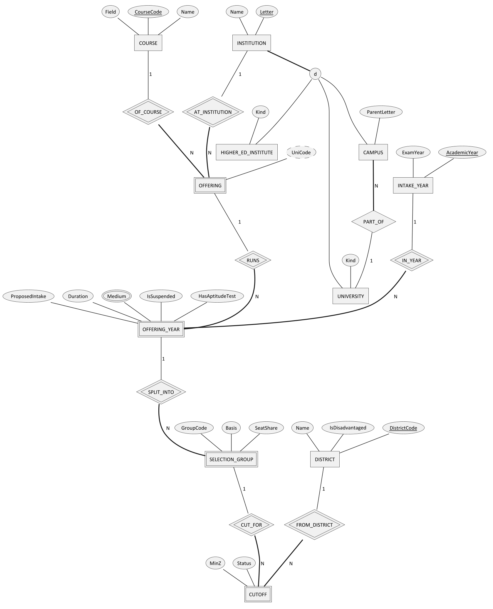
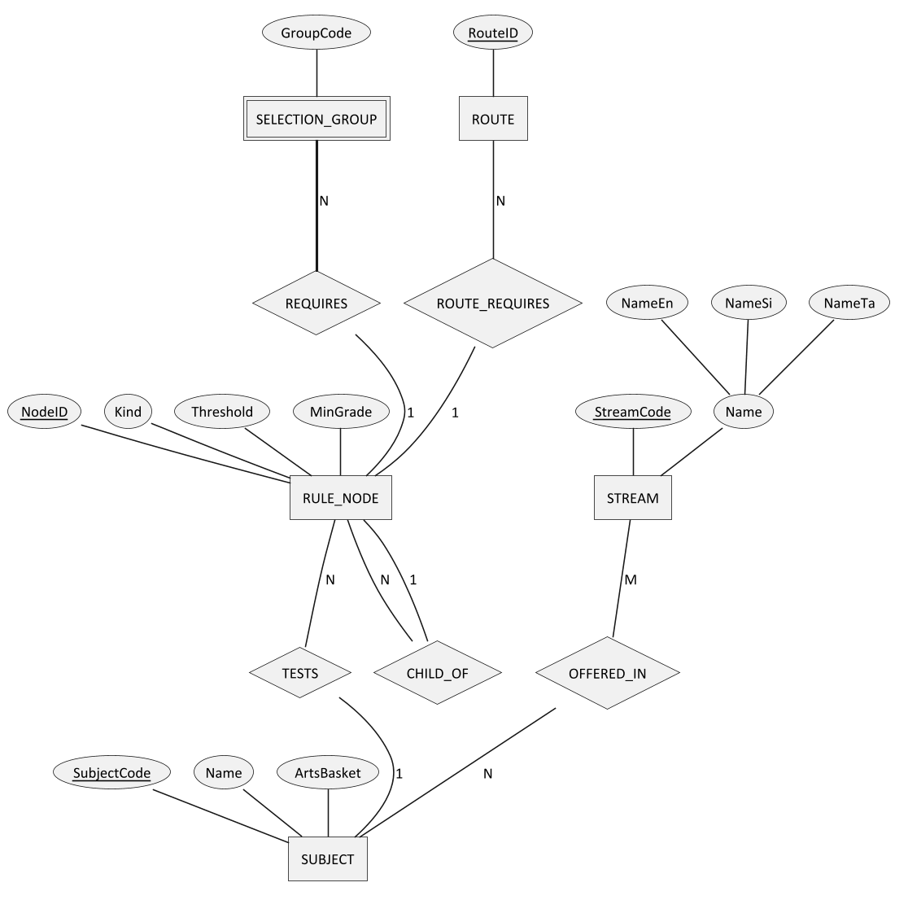
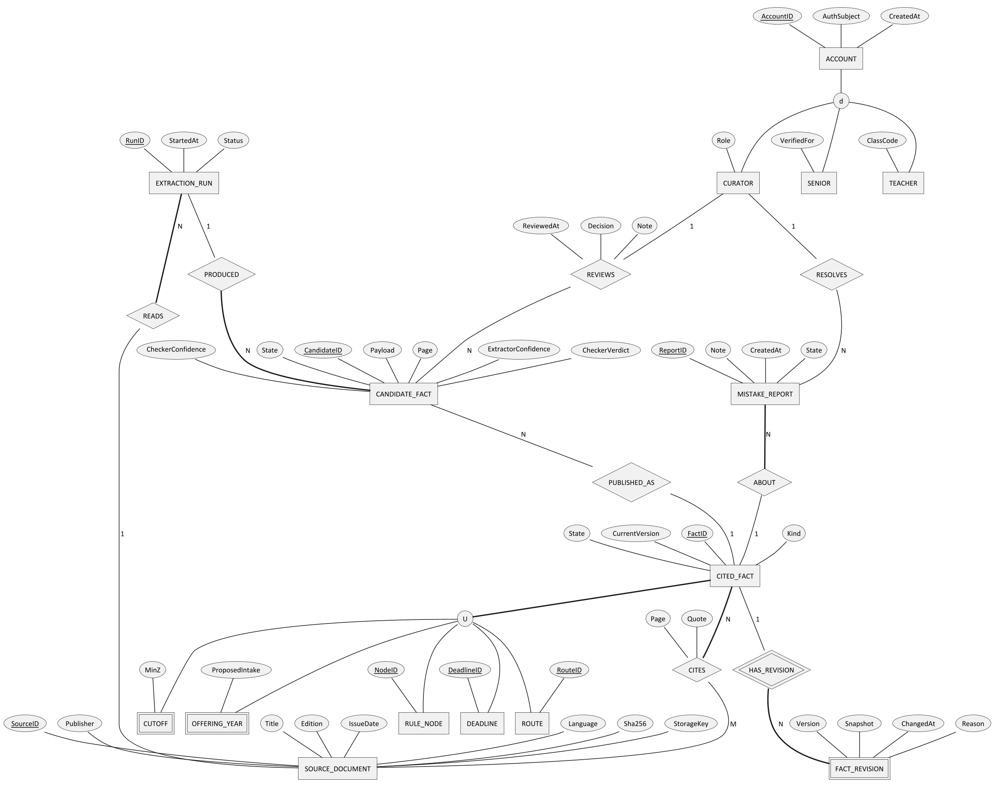
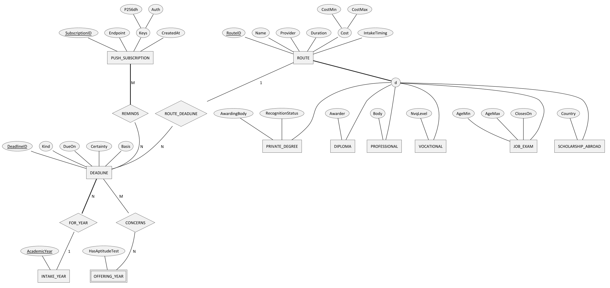
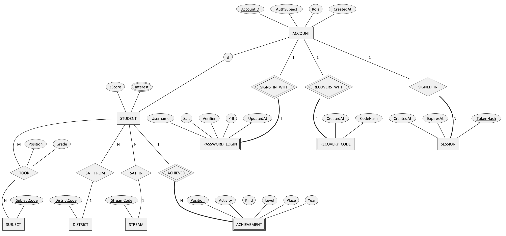
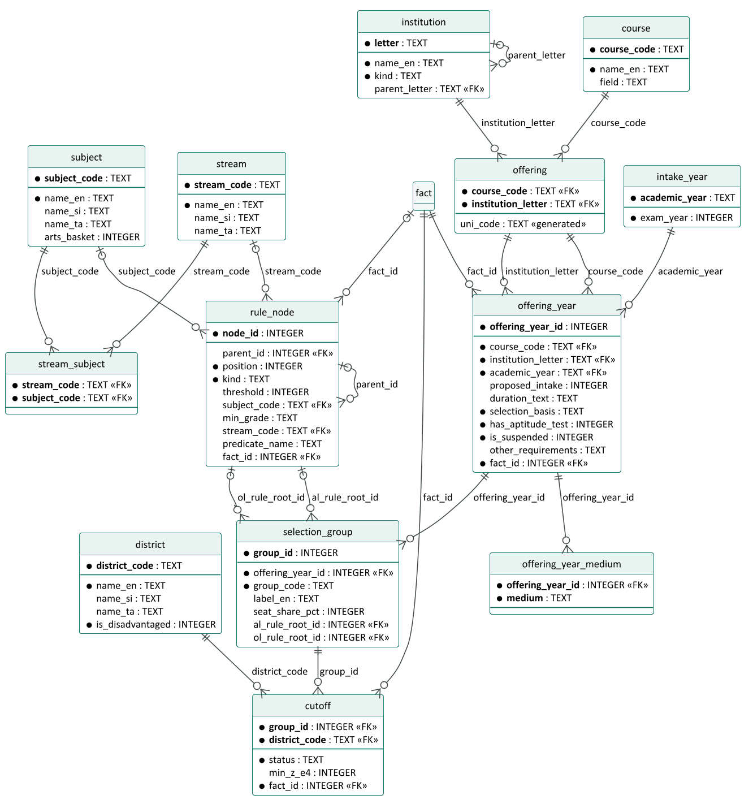
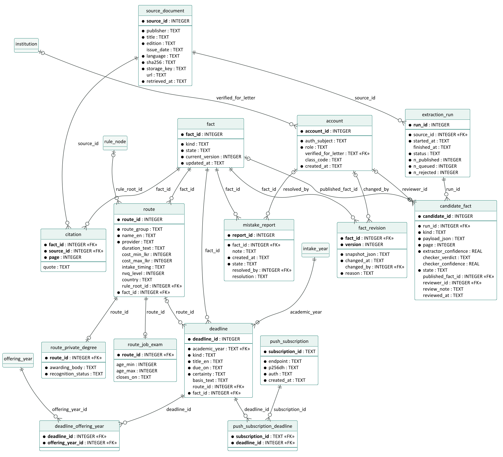
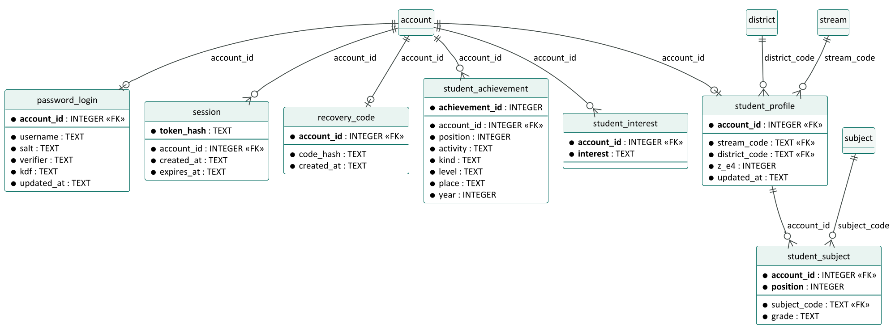

# Introduction

## Purpose

This document designs ZedPath's data in three steps, as a database engineer would: a **conceptual** model in
Enhanced Entity-Relationship (EER) notation, its **logical** relational schema derived with the standard
mapping algorithm and normalised, and the **physical** schema for Cloudflare D1. The physical schema is the real
migration file the application uses, and it has been proved by loading the real UGC data into it.

## Scope

All data held on the server for Releases R1 and R2. By default the student's own profile lives only on their
device (NFR-030). Change request CR-001 (5 October 2026) adds an **optional** student account: a student who
chooses to create one keeps the same profile on the server, under a username only, so it follows them between
devices and can drive reminders. Section 2.5 models it. The preference list stays on the device.

## Intended audience

Developers, reviewers and anyone assessing the data design.

## Relationship to other documents

Table: Position of this document in the ZedPath document set

| Document | Relationship |
|---|---|
| ZP-DOC-03 SRS | Parent. Business rules BR-001 to BR-043 and data-quality requirements NFR-050 to NFR-052 become entities and constraints |
| ZP-DOC-04 Use Case Model | Parent. Nouns in the use cases name the entities |
| ZP-DOC-06 Software Architecture | Child. Decides how the read path uses this schema within free-plan limits |
| `migrations/0001_initial_schema.sql` | Implementation. Appendix A reproduces it verbatim |
| `migrations/0002_reference_data.sql`, `0003_student_accounts.sql` | Implementation of CR-001. 0002 is generated reference data; Appendix B reproduces 0003 verbatim |

## Notation

Conceptual diagrams use Chen notation as extended by Elmasri and Navathe: rectangles are entities; double
rectangles are **weak** entities; diamonds are relationships; double diamonds are **identifying** relationships;
ovals are attributes, with keys underlined, double ovals for **multi-valued** and dashed ovals for **derived**
attributes; bold lines show **total participation**; a circle marked *d* or *o* shows a **disjoint** or
**overlapping specialisation**, and a circle marked *U* a **union category**. Partial keys of weak entities are
named in the entity catalogue. Logical diagrams use crow's-foot (Information Engineering) notation.

# Conceptual model (EER)

## Offerings and cut-offs

The admission domain has a feature that a simple design misses: a **course of study** (for example, Management)
is offered at several **institutions**; each pair is an **offering** with its own Uni-Code; an offering exists
anew in each **intake year** with its own intake and requirements; and a few offerings split their seats into
**selection groups** by stream or category, each with its own cut-offs. Loading the real 2025/26 cut-off table
confirmed this: its 260 columns correspond to 255 Uni-Codes, because five Uni-Codes are split.

## Subjects and requirement rules

Entry requirements follow twenty different patterns (BR-020). Instead of twenty columns or free text, every
requirement is a **tree of rule nodes** (recursive relationship CHILD_OF) whose leaves test subjects. One
structure serves state-university selection groups and other routes alike.

## Provenance and trust

Every published fact must cite its source (BO-2). Cut-offs, offering details, rules, deadlines and routes are
different entity types, yet each needs citations, revisions and mistake reports. The model makes them members
of one **union category**, CITED_FACT, so these trust features are designed once.

## Journey and other routes

## Student accounts (CR-001)

A student account is optional. ACCOUNT, already the superclass of the staff roles, gains a fourth subclass,
STUDENT. Each way of signing in is its own weak entity of ACCOUNT, so a later identity provider (for example
Google sign-in) adds an entity without touching the others. A password is never stored: PASSWORD_LOGIN holds a
salt and a *verifier*, a hash of a key the student's device derives from the password. A STUDENT's results are
the attributes the device already keeps: a Z-score, the stream sat (SAT_IN), the district sat from (SAT_FROM), and
three subjects with grades (TOOK, whose attributes are Grade and Position). Achievements are a weak entity with
partial key Position; interests are a multi-valued attribute. No name, email address or telephone number exists
anywhere in the model.

## Entity catalogue

Table: Entities, their type, identifier and the requirements that justify them

| Entity | Type | Identifier | Justified by |
|---|---|---|---|
| STREAM, SUBJECT | Strong | StreamCode; SubjectCode | BR-010 to BR-012 |
| DISTRICT | Strong | DistrictCode | BR-006, BR-007 |
| INSTITUTION | Strong, superclass of UNIVERSITY, CAMPUS, HIGHER_ED_INSTITUTE (disjoint, total) | Letter | BR-015 |
| COURSE | Strong | CourseCode (3 digits) | BR-015 |
| OFFERING | Weak, owners COURSE and INSTITUTION | (CourseCode, Letter); UniCode derived | BR-015 |
| INTAKE_YEAR | Strong | AcademicYear | BR-028 |
| OFFERING_YEAR | Weak, owners OFFERING and INTAKE_YEAR | (UniCode, AcademicYear) | BR-013, BR-014, BR-025, BR-026 |
| SELECTION_GROUP | Weak, owner OFFERING_YEAR | partial key GroupCode | Discovered in the 2025/26 cut-off table |
| CUTOFF | Weak, owners SELECTION_GROUP and DISTRICT | (group, District) | BR-028, BR-029 |
| RULE_NODE | Strong, recursive | NodeID | BR-020 to BR-022 |
| CITED_FACT | Union category of CUTOFF, OFFERING_YEAR, RULE_NODE, DEADLINE, ROUTE | FactID (surrogate) | BO-2, FR-209, FR-911 |
| SOURCE_DOCUMENT | Strong | SourceID; Sha256 unique | FR-901, FR-902 |
| FACT_REVISION | Weak, owner CITED_FACT | partial key Version | FR-911 |
| EXTRACTION_RUN, CANDIDATE_FACT | Strong | RunID; CandidateID | FR-903 to FR-907 |
| ACCOUNT | Strong, superclass of CURATOR, SENIOR, TEACHER, STUDENT (disjoint, partial) | AccountID | NFR-032, FR-704, FR-706, CR-001 |
| STUDENT | Subclass of ACCOUNT | AccountID (inherited) | CR-001 |
| PASSWORD_LOGIN, RECOVERY_CODE | Weak, owner ACCOUNT, 1:1 | AccountID (owner's key); Username unique | CR-001 |
| SESSION | Strong, N:1 to ACCOUNT | TokenHash | CR-001 |
| ACHIEVEMENT | Weak, owner STUDENT | partial key Position | CR-001, BR on special intakes (handbook Section 6) |
| MISTAKE_REPORT | Strong | ReportID | FR-910 |
| DEADLINE | Strong | DeadlineID | FR-401 to FR-403 |
| ROUTE | Strong, superclass of six route groups (disjoint, total) | RouteID | FR-501 to FR-507 |
| PUSH_SUBSCRIPTION | Strong | SubscriptionID | FR-405, FR-406 |

# Rule grammar

A requirement is stored as a tree of `rule_node` rows. Evaluation assigns each of the student's three A/L subjects
to **at most one** leaf, which captures the handbook's meaning of phrases such as "and the third subject from".

Table: Rule node kinds and their meaning

| Kind | Meaning | Example (handbook pattern) |
|---|---|---|
| ALL | Every child is satisfied, by distinct subjects | Fixed trio (pattern 1) |
| ANY | At least one child is satisfied | "Combined Mathematics **or** Physics" |
| AT_LEAST *n* | At least *n* children are satisfied, by distinct subjects | "two other subjects from the list" (pattern 7) |
| SUBJECT *s* ≥ *g* | Leaf: the student has subject *s* at grade *g* or better, and it is not used elsewhere | "a 'C' grade in Chemistry" |
| ANY_SUBJECTS *n* ≥ *g* | *n* further subjects of any kind, not used elsewhere | "any other two subjects" (pattern 8) |
| GRADE_COUNT *n* ≥ *g* | A check on subjects already used: at least *n* of the listed subjects reach grade *g* | Medicine: two 'C' grades (pattern 2) |
| STREAM_IS *x* | Leaf: the student's stream is *x* | "any three subjects in the Commerce Stream" (pattern 13) |
| PREDICATE *name* | A named check implemented in code | ARTS_BASKETS: the Arts basket rules (pattern 17) |
| OL_SUBJECT *s* ≥ *g* | Leaf in the O/L tree: the O/L subject *s* at grade *g* or better | "a Credit Pass in English" (pattern 18) |

Example: Medicine (Uni-Code 001A) is ALL( SUBJECT Biology ≥ S, SUBJECT Chemistry ≥ S, SUBJECT Physics ≥ S,
GRADE_COUNT 2 ≥ C of {Biology, Chemistry, Physics} ). Category splits with separate seats (pattern 14) are modelled
as separate selection groups, each with its own rule tree.

# Mapping the EER model to relations

The relational schema was derived with the standard nine-step algorithm.

Table: EER-to-relational mapping steps applied

| Step | Construct | Applied to | Result |
|---|---|---|---|
| 1 | Strong entities | STREAM, SUBJECT, DISTRICT, COURSE, INTAKE_YEAR, RULE_NODE, SOURCE_DOCUMENT, EXTRACTION_RUN, CANDIDATE_FACT, MISTAKE_REPORT, DEADLINE, PUSH_SUBSCRIPTION, ACCOUNT, ROUTE | One table each, primary key from the key attribute |
| 2 | Weak entities | OFFERING; OFFERING_YEAR; SELECTION_GROUP; CUTOFF; FACT_REVISION | Owners' keys become part of the primary key: `offering(course_code, institution_letter)`, `cutoff(group_id, district_code)`, `fact_revision(fact_id, version)`. OFFERING_YEAR and SELECTION_GROUP also get surrogate keys to keep later foreign keys short |
| 3 | 1:1 relationships | CANDIDATE_FACT PUBLISHED_AS CITED_FACT | Foreign key `published_fact_id` |
| 4 | 1:N relationships | PART_OF, CHILD_OF, TESTS, REQUIRES, READS, PRODUCED, ABOUT, RESOLVES, REVIEWS, FOR_YEAR | Foreign key on the N side; REVIEWS' attributes (decision, note, time) move into `candidate_fact` |
| 5 | M:N relationships | OFFERED_IN, CITES, CONCERNS, REMINDS | Relationship tables `stream_subject`, `citation` (with page and quote), `deadline_offering_year`, `push_subscription_deadline` |
| 6 | Multi-valued attributes | Medium of OFFERING_YEAR | Table `offering_year_medium` |
| 7 | N-ary relationships | None | Not needed |
| 8 | Specialisation | INSTITUTION; ACCOUNT | Option 8C, one table with a discriminator (`kind`, `role`): subclasses have almost no own attributes |
| 8 | Specialisation | ROUTE | Option 8A: superclass table plus `route_private_degree` and `route_job_exam` for subclasses with several constrained attributes; single-attribute subclasses keep the attribute on `route` with a guard constraint |
| 9 | Union category | CITED_FACT | Surrogate key `fact_id` in table `fact`; every member table carries a unique foreign key to it |

The student-account constructs (CR-001) were mapped with the same algorithm:

Table: Mapping of the student-account model

| Step | Construct | Result |
|---|---|---|
| 2 | Weak entities PASSWORD_LOGIN, RECOVERY_CODE (1:1 with the owner) | `password_login`, `recovery_code`, primary key = owner's `account_id` (at most one per account). Kept apart from `account` so staff rows carry no password columns and each sign-in method can be added or removed alone |
| 2 | Weak entity ACHIEVEMENT | `student_achievement` with surrogate `achievement_id`; the partial key becomes UNIQUE (`account_id`, `position`) |
| 4 | 1:N SIGNED_IN | Foreign key `session.account_id` |
| 4 | 1:N SAT_IN, SAT_FROM and the Z-score | Moved, with the Z-score, into `student_profile` keyed by `account_id`. A separate relation because participation is partial: an account may exist before results are entered, so no NULL-filled columns on `account` (option for partial 1:1 participation) |
| 5 | M:N TOOK (Grade, Position) | `student_subject(account_id, position, subject_code, grade)`; at most three per student through CHECK (position 1 to 3), no subject twice through UNIQUE |
| 6 | Multi-valued Interest | `student_interest(account_id, interest)` |
| 8 | Specialisation STUDENT | Option 8C as before: the `role` discriminator gains `STUDENT`; triggers refuse student rows for any other role |

# Normalisation

## From the source form to 1NF

The UGC cut-off table, as printed, is a single wide relation: one row per district and one column per offering,
with each column header packing several facts into one string, for example "MANAGEMENT STUDIES (TV) - A
[Commerce Stream] (University of Vavuniya)", plus markers \* (merit only) and \# (aptitude test). It violates
first normal form twice: a **repeating group** (260 offering columns) and **non-atomic values** (the header).
Unpivoting gives one row per (offering column, district), and splitting the header gives atomic attributes:

> R1 ( UniCode, CourseCode, CourseName, Letter, InstitutionName, Year, GroupCode, District, IsDisadvantaged,
> MinZ, Status, ProposedIntake, SelectionBasis, HasAptitudeTest, Medium )

## Functional and multi-valued dependencies

Table: Dependencies identified in R1

| # | Dependency | Source of the rule |
|---|---|---|
| FD1 | UniCode → CourseCode, Letter (and the reverse: CourseCode, Letter → UniCode) | BR-015 |
| FD2 | CourseCode → CourseName | Handbook course list |
| FD3 | Letter → InstitutionName | Handbook Uni-Code list |
| FD4 | District → IsDisadvantaged | BR-007 |
| FD5 | UniCode, Year → ProposedIntake, SelectionBasis, HasAptitudeTest | Handbook, per intake |
| FD6 | UniCode, Year, GroupCode, District → MinZ, Status | Cut-off table |
| MVD1 | UniCode, Year ↠ Medium | Medium is independent of every other attribute |

The candidate key of R1 is (UniCode, Year, GroupCode, District, Medium).

## 2NF, 3NF and BCNF

- **2NF** removes attributes that depend on part of the key: FD5's attributes move to OFFERING_YEAR(UniCode,
  Year, ...); FD4's to DISTRICT; FD1 to OFFERING. CUTOFF keeps only MinZ and Status, which need the whole key.
- **3NF** removes transitive dependencies: UniCode → CourseCode → CourseName puts CourseName in COURSE;
  UniCode → Letter → InstitutionName puts the name in INSTITUTION.
- **BCNF**: in every resulting relation, every determinant is a candidate key. The only relation with two
  candidate keys, OFFERING, has (CourseCode, Letter) and the derived UniCode, both keys, so it is in BCNF.
- **4NF**: MVD1 is non-trivial, so Medium moves to its own relation, `offering_year_medium`.

The same analysis applied to the provenance data separates `citation` (fact, source, page) from `fact`, because a
fact may cite several pages and a page supports many facts.

The student-account relations are in BCNF by construction. In each, the only determinants are the keys:
`password_login` has two candidate keys, `account_id` and `username`, and every other attribute depends on
either. `student_subject` has the candidate keys (`account_id`, `position`) and (`account_id`, `subject_code`),
with Grade depending on both. A student's interests are independent of their achievements (MVD AccountID ↠
Interest), so they are kept in separate relations (4NF).

## Deliberate departures

Table: Controlled denormalisations and why they are safe

| Departure | Reason | How consistency is kept |
|---|---|---|
| `uni_code` stored alongside its parts in `offering` | Lookup by the code students know | Generated column, computed by the database; cannot disagree |
| Surrogate keys on `offering_year` and `selection_group` | Short foreign keys in the 13,000-row `cutoff` table | Natural keys kept as UNIQUE constraints |
| Read model for the student path (ZP-DOC-06) | D1 free plan allows 5 million row reads a day; a district's full eligibility view reads about 3,000 rows, which would cap ZedPath near 1,600 students a day | Built from D1 by a single job after each data change, versioned, and never edited directly |

# Physical design for Cloudflare D1

## Conventions

- **STRICT tables**: every value must match its declared type.
- **Exact Z-scores**: stored as integers in ten-thousandths (`min_z_e4`; 1.4821 is stored as 14821), so comparisons
  are exact (NFR-051). The valid range −4.0000 to +4.0000 is a CHECK constraint (BR-005).
- **Enumerations** (streams, statuses, kinds, grades) are CHECK constraints, so invalid states cannot be stored.
- **Cross-column rules** are CHECK constraints: a CAMPUS must have a parent university; a VALUE cut-off must have
  a number and an NQC cut-off must not; an auto-published candidate must have two-model agreement at 0.90 or more
  (FR-905); an estimated deadline must state its basis (FR-402).
- **Foreign keys** are enforced by D1 by default (equivalent to `PRAGMA foreign_keys = ON`).
- **Personal data**: without an account, the only student-linked table is `push_subscription`, holding a browser
  push endpoint and keys that the student opted in to share (NFR-030). With an optional account (CR-001), the
  student's results, achievements and interests are kept under a username they choose; there are still no
  names, contact details or telephone numbers. `DELETE FROM account` cascades to every row of that student.
- **Secrets are stored only as hashes** (CR-001): `password_login.verifier` = SHA-256 of a key that the
  device derives with PBKDF2-HMAC-SHA256 at 600,000 rounds (the password never reaches the server);
  `session.token_hash` = SHA-256 of the random cookie token; `recovery_code.code_hash` = SHA-256 of an 80-bit
  random code. A copy of the tables therefore cannot be replayed to log in, and a guessed password costs an
  attacker 600,000 rounds per guess. Verifying a login costs the Worker one SHA-256, well inside the free plan's
  10 ms CPU limit.

## Indexes

Table: Secondary indexes and the query each serves

| Index | Serves |
|---|---|
| `idx_offering_uni_code` (unique) | Look up an offering by Uni-Code |
| `idx_cutoff_district` | All cut-offs for one district: the core of eligibility and banding |
| `idx_offering_year_year` | All offerings of an intake year |
| `idx_rule_node_parent` | Loading rule trees in order |
| `idx_deadline_year_due` | Journey timeline by date |
| `idx_citation_source` | All facts citing a source (re-extraction, audits) |
| `idx_candidate_queue` (partial, QUEUED only) | Curator review queue |
| `idx_report_open` (partial, OPEN only) | Open mistake reports |
| `idx_session_account` | Log out on every device; clearing expired sessions at log-in |
| `idx_student_profile_stream`, `idx_student_profile_district` | Foreign-key checks when a stream or district row changes; counts for reminders by district |
| `idx_student_subject_subject` | Foreign-key checks on `subject` |

## Capacity against the free plan

Table: Data volume per intake year and free-plan headroom

| Measure | Value | Free-plan limit |
|---|---|---|
| Cut-off rows per intake year | about 6,500 | — |
| Database size with two intake years loaded | 2.3 MB | 500 MB per database |
| Projected size with five years and all routes | under 10 MB | 500 MB per database |
| Rows read to rebuild the read model once | about 15,000 | 5 million per day |
| Rows written to load one intake year | about 13,500 (with facts and citations) | 100,000 per day |

# Validation against real data

The design was tested by loading the official data, not sample data. `tools/seed/validate-schema.ts` applies the
migration to an in-memory SQLite database (the engine D1 is built on), loads the UGC 2025/26 data and the 2024/25
cut-offs printed in the handbook, runs integrity checks, and then attempts 24 deliberately invalid inserts.

Table: Schema validation results (5 October 2026)

| Check | Result | Expected |
|---|---:|---:|
| Uni-Codes loaded | 255 | 255 |
| Course codes / institutions | 121 / 20 | 121 / 20 |
| 2025/26 proposed intake across Uni-Codes (plus 900 Arts additional intake = 42,937) | 42,037 | 42,037 |
| 2025/26 cut-off columns matched exactly to a Uni-Code | 260 | 260 |
| 2025/26 cut-off cells loaded / of which NQC | 6,500 / 1,026 | 6,500 / 1,026 |
| Uni-Codes split into more than one selection group | 5 | 5 |
| Uni-Codes without cut-offs | 0 | 0 |
| Merit-only offerings with differing district values | 0 | 0 |
| 2024/25 cut-off cells loaded | 6,425 | — |
| Facts without a citation | 0 | 0 |
| Foreign-key violations | 0 | 0 |
| Invalid inserts rejected by constraints | 24 of 24 | 24 of 24 |

The student-account tables (CR-001) are validated by `worker/account.test.ts`, which applies all three migrations
to an in-memory SQLite database with foreign keys on, exactly as D1 enforces them, and drives the real API.

Table: Student-account validation results (5 October 2026)

| Check | Result |
|---|---|
| Schema after migrations 0001 to 0003 | 35 tables, 190 columns, 52 foreign keys, 12 indexes, 3 triggers |
| Reference rows loaded by 0002 (streams / districts / subjects) | 6 / 25 / 59 |
| Invalid inserts rejected (unknown role, bad username, wrong-length hash, unknown KDF, Z-score out of range, unknown stream, district or subject, fourth subject, duplicate subject, grade D, blank or unknown achievement fields, unknown interest, expiry before creation, student rows on a staff account) | 17 of 17 |
| Deleting one account removes exactly its rows from all 8 account tables and nothing of another account | Pass |
| A request can read or change only its own session's account, whatever the request body says | Pass |
| A save that fails validation changes nothing (atomic batch) | Pass |
| Bugs planted on purpose (body-supplied account id, missing cascade, missing cross-site check, key not compared) caught by a failing test | 4 of 4 |
| Same migrations applied to the local D1 runtime (`wrangler d1 migrations apply --local`) | 3 of 3 applied |

Matching the cut-off table to Uni-Codes surfaced spelling differences between the two UGC documents
("BIO.SC" and "BIOLOGICAL SC.", "AGRI BUSINESS" and "AGRIBUSINESS", "BIO RESOURCES" and "BIORESOURCES") and one
misprinted university name. The loader normalises these explicitly; no column is matched by guesswork.

# Traceability: requirements to tables {.appendix}

Table: Requirements and the tables that realise them

| Requirement | Tables |
|---|---|
| BR-005, NFR-051 (exact Z-scores) | `cutoff.min_z_e4` with range CHECK |
| BR-006, BR-007 (districts) | `district` |
| BR-010 to BR-012 (streams, subjects) | `stream`, `subject`, `stream_subject` |
| BR-013, BR-014 (quotas, merit-only) | `offering_year.selection_basis` |
| BR-015 (Uni-Codes) | `course`, `institution`, `offering` |
| BR-020 to BR-024 (requirements) | `rule_node`, `selection_group.al_rule_root_id`, `ol_rule_root_id`, `offering_year.other_requirements` |
| BR-025, BR-026 (aptitude, suspended) | `offering_year.has_aptitude_test`, `is_suspended` |
| BR-028, BR-029 (cut-offs, NQC) | `selection_group`, `cutoff` |
| FR-209, BO-2, NFR-050 (every fact sourced) | `fact`, `citation`, `source_document` |
| FR-401 to FR-406 (journey, reminders) | `deadline`, `deadline_offering_year`, `push_subscription`, `push_subscription_deadline` |
| FR-501 to FR-507 (other routes) | `route`, `route_private_degree`, `route_job_exam` |
| FR-901 to FR-911 (data and trust) | `source_document`, `extraction_run`, `candidate_fact`, `fact_revision`, `mistake_report`, `account` |
| CR-001 (optional student account, cross-device profile) | `account` (role STUDENT), `password_login`, `session`, `recovery_code`, `student_profile`, `student_subject`, `student_achievement`, `student_interest` |

# Physical schema (migration 0001) {.appendix}

Reproduced verbatim from `migrations/0001_initial_schema.sql`.

<!-- include: migrations/0001_initial_schema.sql -->

# Student accounts (migration 0003) {.appendix}

Reproduced verbatim from `migrations/0003_student_accounts.sql`. Migration 0002 inserts the reference data (6
streams, 25 districts, 59 subjects) and is generated by `tools/seed/reference-sql.ts` from the compiled rulebook.

<!-- include: migrations/0003_student_accounts.sql -->

# Glossary {.appendix}

Table: Terms used in this document

| Term | Meaning |
|---|---|
| BCNF | Boyce-Codd normal form: every determinant is a candidate key |
| Category (union type) | An EER subclass of the union of several superclasses |
| D1 | Cloudflare's serverless SQL database, built on SQLite |
| Identifying relationship | The relationship that links a weak entity to the owner that identifies it |
| MVD | Multi-valued dependency, the basis of fourth normal form (4NF) |
| Read model | A query-optimised copy of data derived from the system of record |
| STRICT table | An SQLite table that rejects values of the wrong type |
| Weak entity | An entity that cannot be identified by its own attributes alone |

# References {.appendix}

Table: Sources referred to in this document

| Ref | Source |
|---|---|
| [1] | R. Elmasri and S. Navathe, *Fundamentals of Database Systems*, 7th edition, Pearson, 2016 (chapters 3, 4, 9, 14, 15) |
| [2] | Cloudflare, *D1: Define foreign keys* and *SQL statements*, developers.cloudflare.com, retrieved 5 October 2026 |
| [3] | Cloudflare, *D1 limits and pricing*, developers.cloudflare.com, retrieved 5 October 2026 |
| [4] | SQLite, *STRICT Tables* and *Generated Columns*, sqlite.org |
| [5] | UGC handbook and cut-off table 2025/26 (see `data/ugc/PROVENANCE.md`) |
| [6] | ZP-DOC-03 Software Requirements Specification |
